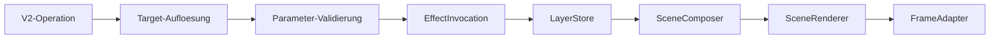

# Runtime-Layer-Modell

Diese Seite beschreibt die internen Layer des Service-Kerns. Layer sind ein
Implementierungsdetail. Oeffentliche Aufrufer waehlen einen Effekttyp und eine
passende Operation, nicht einen beliebigen Layer.

## Pipeline

Anwendungsspezifische Callbacks werden vor dieser Pipeline in
`src/integrations/application_commands.py` auf generische V2-Operationen
abgebildet.

## Interne Layer

| Layer | Prioritaet | Oeffentlicher Typ | Dauerprofil |
|---|---:|---|---|
| `BACKGROUND_STATE_LAYER` | 100 | State, Slot `background` | unbestimmt |
| `STATE_LAYER` | 200 | State, Slot `primary` | unbestimmt |
| `TEMP_OVERLAY_LAYER` | 400 | Overlay, Modus `timed` | endlich |
| `ONGOING_OVERLAY_LAYER` | 500 | Overlay, Modus `controlled` | unbestimmt |
| `EVENT_LAYER` | 600 | Event | endlich |

Die Definition legt Typ und Overlay-Modus fest. Damit ist die Layerwahl
deterministisch. `MAIN_LAYER` gehoert nicht zum V2-Modell.

## State-Slots

Ein State laeuft unbestimmt, bis er ersetzt oder geloescht wird.

- `background` ist persistent und bildet den Grundmodus.
- `primary` bildet den aktuellen aktiven Zustand.
- `set ... --off` oder `--toggle` wirkt nur, wenn genau dieses Ziel im Slot
  aktiv ist.

## Overlay-Channels

Kontrollierte Overlays besitzen einen stabilen Channel. `set` erstellt oder
ersetzt die Anzeige, `update` aendert ausschliesslich deklarierte
Runtime-Eingaben, `clear` entfernt den Channel.

Zeitbegrenzte Overlays besitzen eine feste Dauer und koennen ohne Channel
gesetzt werden. Sie akzeptieren weder `off` noch `toggle`; ihr Lebenszyklus
endet automatisch.

## Event-Queue

Nur `EVENT_LAYER` besitzt Queue-Semantik:

- hoehere `priority` wird zuerst abgespielt
- bei gleicher Prioritaet gilt FIFO
- das laufende Event wird nicht unterbrochen
- die Laufzeit beginnt bei Aktivierung

## Konfiguration und Runtime-Eingaben

`config` beschreibt die stabile Instanzkonfiguration, etwa Farben,
Geschwindigkeit oder Helligkeit. `inputs` beschreibt veraenderliche
Laufzeitwerte, etwa Richtung oder Fortschritt. Runtime-Eingaben sind nur fuer
kontrollierte Overlays erlaubt.

## Status-Snapshot

`ControllerRuntime.get_status()` gibt unter `render_layers` diese sichtbaren
Gruppen aus:

- `background_state_visual`
- `state_visual`
- `direction_visual` fuer laufende Overlays
- `countdown_visual` fuer temporaere Overlays

Events werden getrennt als aktives Event beziehungsweise Queue abgebildet.

## Background-State-Persistenz

Nur `BACKGROUND_STATE_LAYER` wird in `background_state.json` persistiert.
Transiente Servicemodi werden nicht uebernommen. Ohne gueltige Datei verwendet
der Service `solid_color` in Weiss mit reduzierter Helligkeit.
