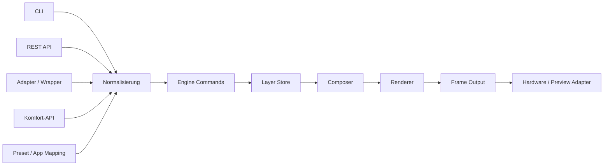
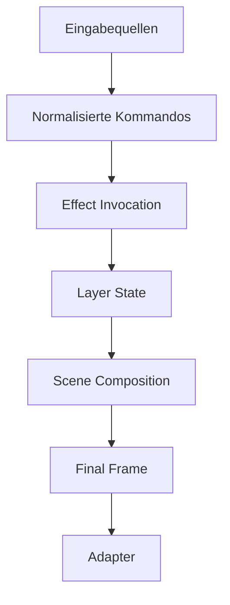
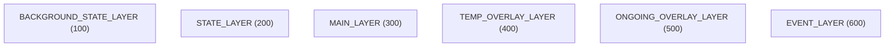
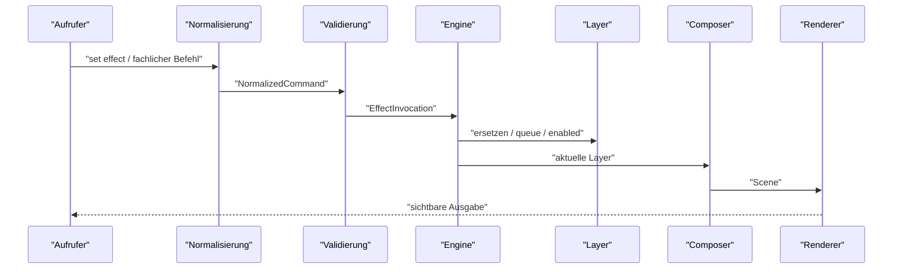

# Zielarchitektur

Diese Datei beschreibt das Gesamtbild des Zielsystems nach der Neuausrichtung.

## Kernidee

Es gibt kuenftig genau **eine** offizielle Ausfuehrungs-Engine:

- der laufende Service
- mit einem Layer-System als Source of Truth
- mit einer vorgeschalteten Normalisierungsschicht
- und ohne direkte Umgehung der Engine fuer CLI, API, Adapter oder Komfort-Frontends

## Systemuebersicht

## Schichten des Zielsystems

## Finale Layer

## Layer-Semantik

| Layer | Prioritaet | Zweck | Typisches Verhalten |
|---|---:|---|---|
| `BACKGROUND_STATE_LAYER` | 100 | unterste persistente Grundanzeige | dauerhaft, restorable |
| `STATE_LAYER` | 200 | laufender Anwendungszustand | dauerhaft, nicht persistent |
| `MAIN_LAYER` | 300 | freie Hauptanzeige | endlich oder unendlich |
| `TEMP_OVERLAY_LAYER` | 400 | zeitlich begrenzte Einblendung | endlich |
| `ONGOING_OVERLAY_LAYER` | 500 | unbegrenzte, temporaere Ueberlagerung | unbestimmt |
| `EVENT_LAYER` | 600 | kurze Ereigniseffekte | Queue, Priorisierung |

## Datenfluss einer Set-Operation

## Was die Engine kuenftig nicht mehr direkt wissen soll

- keine fachlichen Namen wie `listening`, `warning`, `recording`
- keine App-spezifischen Sonderpfade
- keine separaten Spezialbehandlungen fuer `direction`, `countdown`, `progress`

Diese Dinge sollen vor der Engine in normale Effekt-Invocations uebersetzt werden.

## Was die Engine kuenftig wissen soll

- welche Layer es gibt
- welche Prioritaeten sie haben
- welche Effektdefinitionen registriert sind
- welche Effektinstanzen gerade aktiv sind
- welche Validierungs- und Queue-Regeln gelten
- wie daraus die finale Scene zusammengesetzt wird
