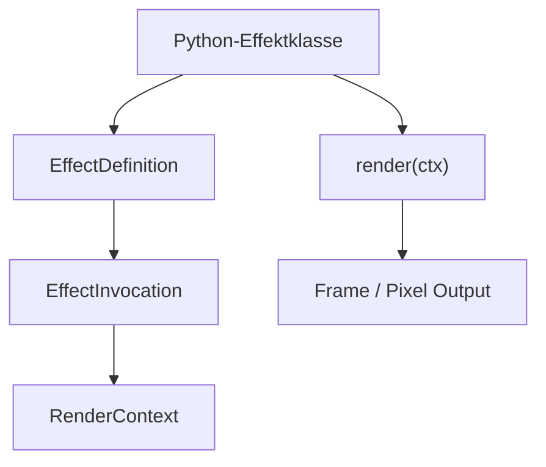
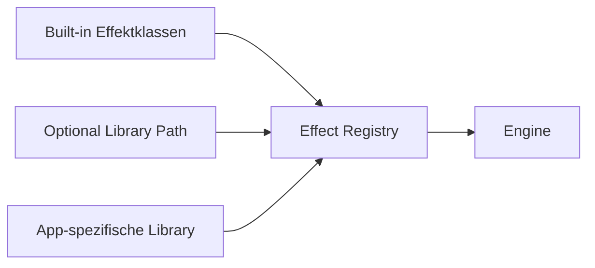
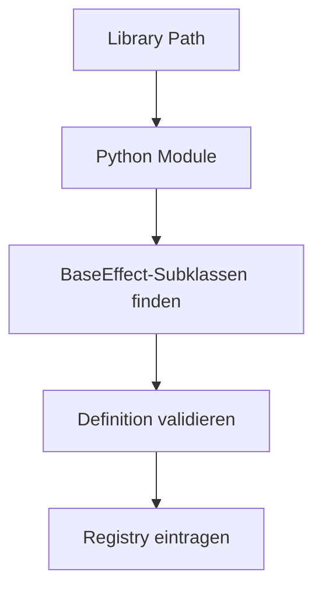
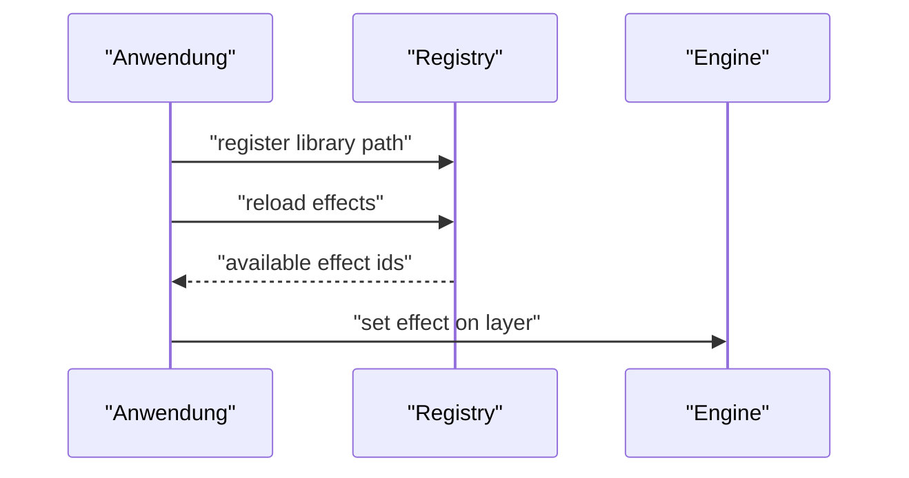

# Effektdefinition und Registry

Diese Datei beantwortet die Strukturfragen rund um `EffectDefinition`, Discovery, Registry und Erweiterbarkeit.

## Kurzfassung

Der Effekt soll kuenftig:

- **nicht** als JSON-Datei mit eingebettetem Python-Code beschrieben werden
- **nicht** aus zwei lose getrennten Welten aus Metadaten hier und Logik dort bestehen
- **sondern** als Python-Effektklasse modelliert werden, an der Definition und Logik direkt zusammenhaengen

Damit bleibt das Modell fuer Entwickler greifbar, waehrend die Engine intern trotzdem sauber mit `EffectDefinition`, `EffectInvocation` und Registry arbeiten kann.

## Woraus besteht ein Effekt letztendlich

Ein Effekt besteht kuenftig aus drei Ebenen:

1. `Python-Effektklasse`
   Heimat von Logik und Definition

2. `EffectDefinition`
   Unveraenderbare Metadaten, Layer-Regeln, Capabilities, Parameter-Schema und Defaults

3. `EffectInvocation`
   Eine konkrete Nutzung des Effekts auf einem Layer



## Sauberer Kompromiss

Die beste Form ist aus meiner Sicht:

- **logisch zusammen**
  Metadaten und Effektlogik liegen an derselben Klasse
- **technisch sauber getrennt**
  die Engine kennt intern weiterhin getrennte Konzepte fuer Definition, Invocation und Registry

Also nicht:

- Datei A nur fuer Metadaten
- Datei B nur fuer Logik

Sondern:

- eine Effektklasse ist die zentrale Heimat
- diese Klasse traegt ihre Definition als Klassenattribut
- die Registry registriert die Klasse anhand dieser Definition

## Zielstruktur einer registrierbaren Effektklasse

```python
class SoftPulseEffect(BaseEffect):
    definition = EffectDefinition(
        id="soft_pulse",
        title="Soft Pulse",
        description="Weiches Pulsieren einer Farbe",
        parameter_schema={...},
        defaults={...},
        layer_rules={...},
        capabilities=EffectCapabilities(...),
    )

    def render(self, ctx: RenderContext) -> list[int | None]:
        ...
```

## EffectDefinition

Die eigentliche `EffectDefinition` bleibt ein strukturiertes Python-Objekt.

```python
@dataclass(slots=True, frozen=True)
class EffectDefinition:
    id: str
    title: str
    description: str
    parameter_schema: dict[str, EffectParamDefinition]
    defaults: dict[str, Any]
    layer_rules: dict[LayerId, LayerRule]
    capabilities: EffectCapabilities
    tags: tuple[str, ...] = ()
    version: int = 1
```

Wichtig:

- die Definition bleibt ein eigenstaendiges Modellobjekt
- sie ist aber nicht "heimatlos", sondern haengt an einer Effektklasse

## Python-Seite: Effektklasse statt Effekt-Thread

Die Engine ruft die Effektklasse pro Render-Tick auf.

### Zielregeln

- kein eigener Thread pro Effekt
- kein `run()`-Loop im Effekt selbst
- stattdessen Engine-gezogenes Rendering ueber `render(context)`

Basisschnittstelle:

```python
class BaseEffect(ABC):
    definition: ClassVar[EffectDefinition]

    @classmethod
    def get_definition(cls) -> EffectDefinition:
        return cls.definition

    @abstractmethod
    def render(self, ctx: RenderContext) -> list[int | None]:
        raise NotImplementedError
```

Warum das sauber ist:

- Service-Modell bleibt konsistent
- Layering und Transparenz bleiben zentral steuerbar
- Spezialeffekte bleiben moeglich
- Definition und Logik koennen nicht so leicht auseinanderlaufen

## Python-Klasse oder Python-Funktion?

Meine Empfehlung:

- **standardmaessig Python-Klasse**
- Funktionen hoechstens als interne Hilfsmittel innerhalb eines Effekts

Warum Klasse als Default:

- sauberer Namensraum
- klarere Discovery und Registry
- bessere Dokumentierbarkeit
- Hilfsmethoden und Speziallogik bleiben sauber kapselbar
- Definition und Logik bleiben an einer Stelle

## Eine Datei pro Effekt oder mehrere Effekte pro Datei?

Meine Empfehlung:

- **nicht** zwanghaft eine Datei pro Effekt
- mehrere fachlich zusammengehoerige kleine Effekte pro Datei sind erlaubt
- grosse oder komplexe Effekte bekommen eigene Datei

Praktische Struktur:

- `effects/basic_states.py`
- `effects/overlays.py`
- `effects/events.py`
- `effects/progress.py`
- `effects/direction.py`

So vermeiden wir:

- zu viele Mikrodaten
- aber auch uebergrosse Sammeldateien

## Registry- und Discovery-Modell

## Zielbild



## Empfohlene Schichten der Registry

Ich wuerde drei Quellen vorsehen:

1. **Built-in Registry**
   Fester interner Standardbestand aus eingebauten Effektklassen

2. **Additional Library Paths**
   Zusaetzliche Pfade mit weiteren Effektbibliotheken

3. **Application-Level Registration**
   Anwendungen duerfen eigene Bibliotheken registrieren

## Discovery nur in festem Ordner?

Meine Empfehlung: **nein, aber mit sicherem Default**

### Default

- feste Built-in-Discovery in einem projektspezifischen Standardordner

### Zusaetzlich

- weitere Library-Pfade duerfen explizit hinzugefuegt werden
- kein implizites rekursives Suchen ueberall

So bleibt das System:

- sicher
- reproduzierbar
- aber trotzdem erweiterbar

## Sollen Anwendungen eigene Bibliotheken oder Pfade hinzufuegen duerfen?

Meine Empfehlung: **ja**

Aber nur ueber klare, explizite Mechanismen wie:

- Konfigurationsdatei
- CLI-Befehl
- API-Befehl
- Service-Startparameter

Beispielhafte Zielkommandos spaeter:

- `register-library-path <path>`
- `list-library-paths`
- `reload-effects`

## Refresh / Reload zur Laufzeit?

Meine Empfehlung: **ja, aber explizit**

Nicht automatisch, sondern ueber einen bewusst ausgeloesten Reload.

### Warum?

- Registry-Zustand bleibt kontrollierbar
- Fehler sind besser nachvollziehbar
- Performance bleibt stabil
- Service-Verhalten wird reproduzierbar

## Vorgeschlagene Registry-Objekte

```python
@dataclass(slots=True)
class EffectLibrarySource:
    source_id: str
    path: str
    kind: str
    enabled: bool = True


@dataclass(slots=True)
class RegisteredEffectType:
    definition: EffectDefinition
    effect_class: type[BaseEffect]
    source_id: str
```

## Discovery-Zielbild

Discovery soll nicht "irgendwelche JSONs mit Code" laden, sondern Python-Effektklassen finden, validieren und registrieren.



## Ziel fuer die Aussenwelt

Eine Anwendung soll kuenftig idealerweise nicht Python-Code in die Engine injizieren, sondern:

1. eine Effektbibliothek an einem bekannten Pfad bereitstellen
2. diesen Pfad registrieren
3. einen Reload ausloesen
4. danach die neu verfuegbaren `effect_id`s normal verwenden

## Abgrenzung zu JSON/YAML

JSON/YAML sollten kuenftig **nicht** den Effekt selbst enthalten, sondern z. B.:

- Presets
- Parameterwerte
- Mappings fachlicher Namen -> `effect_id`
- Beispielkonfigurationen

Nicht empfohlen:

- Python-Code in JSON
- dynamischer Script-Code in YAML

## Beispiel fuer das Zusammenspiel



## Meine klare Empfehlung

Fuer die Endstruktur wuerde ich folgendes festhalten:

- `EffectDefinition` ist ein Python-Objekt
- die Renderlogik lebt in Python
- Definition und Logik leben an derselben Effektklasse
- kein Python-Code in JSON/YAML
- mehrere kleine, zusammenpassende Effekte pro Datei sind erlaubt
- Built-in-Discovery aus festem Ordner
- zusaetzliche Library-Pfade explizit erlauben
- Reload zur Laufzeit ausdruecklich vorsehen
