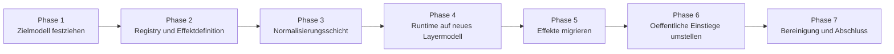

# Umbauplan

Diese Datei beschreibt die empfohlene Reihenfolge des Umbaus und dient gleichzeitig als zentrale Fortschrittsgrundlage.

## Uebersicht

## Phase 1: Zielmodell festziehen

Ziel:

- finale Layernamen
- Effektdatenmodell
- Queue-Regeln
- Persistenzregeln
- Prioritaetsmodell

Status:

- abgeschlossen

Ergebnisse bislang:

- Trennung `EffectDefinition` / `EffectInvocation` festgelegt
- Engine-gezogenes Rendering festgelegt
- sechs finale Layer festgelegt
- Dauer in `ms` festgelegt
- nur `BACKGROUND_STATE_LAYER` persistent
- Event-Queue = `priority + FIFO`

## Phase 2: Registry und Effektdefinition

Ziel:

- finale Form von `EffectDefinition`
- Registry-API
- Built-in-Discovery
- optionale externe Library-Pfade
- Reload-Konzept

Offene Arbeiten:

- keine

## Phase 3: Normalisierungsschicht

Ziel:

- alle Eingabepfade in `NormalizedCommand` ueberfuehren

Betroffene Stellen:

- CLI
- API
- STT-Adapter
- Komfort-APIs
- Presets / fachliche Mappings

## Phase 4: Runtime auf neues Layermodell

Ziel:

- neue Layernamen
- Layer-State-Modell
- Persistenz fuer `BACKGROUND_STATE_LAYER`
- Event-Queue in finaler Form
- Runtime-Sonderfaelle zurueckbauen

## Phase 5: Effekte migrieren

Ziel:

- bestehende Runtime-Visuals als neue Effektdefinitionen ausdruecken
- direkte `LedEffect`-Welt auf die neue Architektur abbilden
- `direction`, `countdown`, `progress` als normale Effekte behandeln

## Phase 6: Oeffentliche Einstiege umstellen

Ziel:

- CLI bleibt kompatibel, nutzt aber die neue Normalisierung
- API bleibt kompatibel, nutzt aber die neue Normalisierung
- direkte Komfortpfade umgehen die Engine nicht mehr

## Phase 7: Bereinigung und Abschluss

Ziel:

- alte Parallelpfade abbauen
- Doku konsolidieren
- Tests erweitern
- Migrationshinweise abschliessen

## Fortschrittslog

### 2026-04-09

- Planungsordner `docs/planning/` angelegt
- Zielarchitektur als zentrale Uebersicht dokumentiert
- Registry-/Discovery-Grundrichtung dokumentiert
- wichtige Entscheidungen aus der Datenmodellabstimmung uebernommen
- erste Built-in-Effektklassen im neuen Schema ergaenzt: `off`, `solid_color`, `soft_pulse`, `warning_flash`
- reine Unit-Tests fuer Render-Verhalten und kleine Built-in-Registry ergaenzt
- Built-in-Registry zentralisiert und Default-Registry fuer Runtime/Composer eingefuehrt
- Normalisierungsschicht fuer State-, Event-, Direction-, Countdown- und Progress-Befehle eingefuehrt
- Runtime intern auf `LayerState` + `EffectInvocation` als Source of Truth umgestellt
- `direction`, `countdown` und `progress` als normale Effektklassen migriert
- API, CLI, Client, Service und STT-Pfad laufen intern ueber dieselbe Normalisierungsschicht
- Queue-Verhalten auf `priority + FIFO` ohne Preemption des laufenden Events umgestellt; Event-Dauer startet erst bei Aktivierung
- Vollsuite nach Abschluss gruen: `221 passed`

## Abschlussstand

Der Umbau ist fuer den dokumentierten Planstand abgeschlossen:

- das Zielmodell ist produktiv im Code verankert
- die Runtime arbeitet ueber eine einzige Invocation-basierte Engine
- Spezialfaelle wurden in normale Effekte ueberfuehrt
- oeffentliche Einstiege nutzen die gleiche innere Kommandoschicht
- die Gesamtsuite bestaetigt den Endstand
