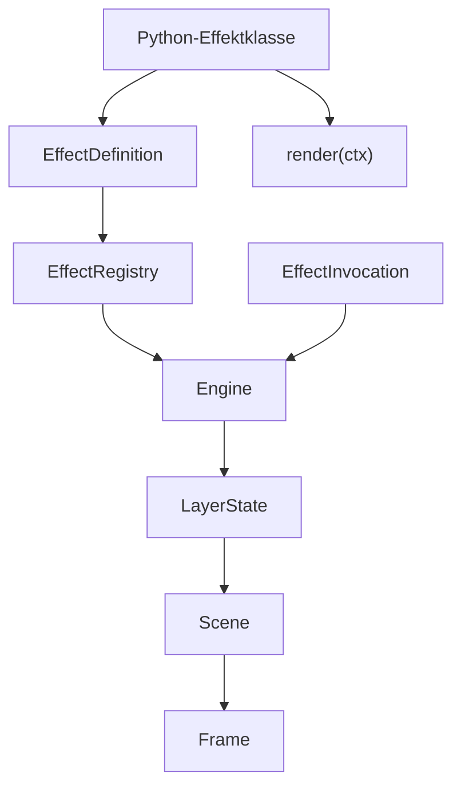
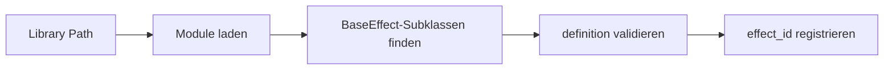
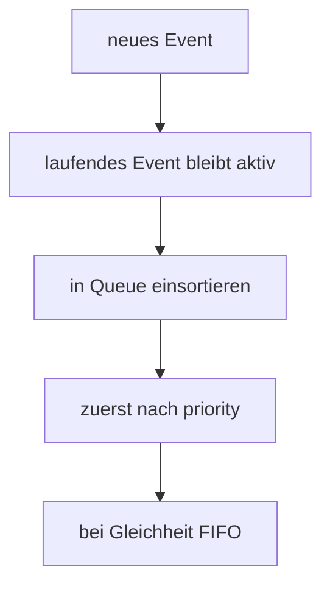

# Technisches Zielschema

Diese Datei beschreibt die nahezu implementierbare Zielstruktur fuer das neue Effektmodell.

Hinweis zum heutigen Stand:

Dieses Dokument ist ein historischer Zielentwurf. Die aktuelle Implementierung laedt Default-Effekte ausschliesslich aus `.lefx`- und `.lefxset`-Artefakten; `legacy_visual` und `EffectRegistry.add_library_path(...)` gehoeren nicht mehr zum aktuellen Vertragsstand.

## Grundprinzip

Die registrierbare Grundeinheit ist eine Python-Effektklasse.

Diese Klasse bringt direkt mit:

- ihre `EffectDefinition`
- ihre Renderlogik

Die Engine arbeitet dann intern mit:

- `EffectDefinition`
- `EffectInvocation`
- `LayerState`
- `NormalizedCommand`
- `EffectRegistry`

## Zielbild auf einen Blick



## Finale Enums

```python
from enum import Enum


class LayerId(str, Enum):
    BACKGROUND_STATE_LAYER = "BACKGROUND_STATE_LAYER"
    STATE_LAYER = "STATE_LAYER"
    MAIN_LAYER = "MAIN_LAYER"
    TEMP_OVERLAY_LAYER = "TEMP_OVERLAY_LAYER"
    ONGOING_OVERLAY_LAYER = "ONGOING_OVERLAY_LAYER"
    EVENT_LAYER = "EVENT_LAYER"


class PlaybackMode(str, Enum):
    SINGLE_RUN = "single_run"
    LOOP = "loop"
    PERSISTENT = "persistent"


class CommandKind(str, Enum):
    SET_EFFECT = "set_effect"
    CLEAR_LAYER = "clear_layer"
    SET_LAYER_ENABLED = "set_layer_enabled"
    RESET_ENGINE = "reset_engine"


class QueueMode(str, Enum):
    FORBIDDEN = "forbidden"
    REPLACE = "replace"
    APPEND = "append"
    PRIORITY_FIFO = "priority_fifo"
```

## Kern-Dataclasses

```python
from dataclasses import dataclass, field
from typing import Any


@dataclass(slots=True, frozen=True)
class EffectParamDefinition:
    name: str
    type: str
    required: bool = False
    default: Any = None
    description: str = ""
    minimum: float | int | None = None
    maximum: float | int | None = None
    enum_values: tuple[Any, ...] = ()
    unit: str | None = None


@dataclass(slots=True, frozen=True)
class EffectCapabilities:
    playback_modes: tuple[PlaybackMode, ...] = (PlaybackMode.SINGLE_RUN,)
    supports_transparency: bool = False
    supports_duration_override: bool = False
    supports_queueing: bool = False
    preemptible: bool = True
    restorable: bool = False
    data_driven: bool = False


@dataclass(slots=True, frozen=True)
class LayerRule:
    allowed: bool = True
    allowed_playback_modes: tuple[PlaybackMode, ...] = ()
    requires_finite_duration: bool | None = None
    requires_indefinite_duration: bool | None = None
    allows_transparency: bool = False
    queue_mode: QueueMode = QueueMode.FORBIDDEN
    persistent_storage: bool = False


@dataclass(slots=True, frozen=True)
class EffectDefinition:
    id: str
    title: str
    description: str
    parameter_schema: dict[str, EffectParamDefinition] = field(default_factory=dict)
    defaults: dict[str, Any] = field(default_factory=dict)
    layer_rules: dict[LayerId, LayerRule] = field(default_factory=dict)
    capabilities: EffectCapabilities = field(default_factory=EffectCapabilities)
    tags: tuple[str, ...] = ()
    version: int = 1


@dataclass(slots=True)
class EffectInvocation:
    invocation_id: str
    effect_id: str
    target_layer: LayerId
    params: dict[str, Any] = field(default_factory=dict)
    enabled: bool = True
    transparent: bool = False
    priority: int | None = None
    playback_mode: PlaybackMode | None = None
    requested_duration_ms: int | None = None
    source: str | None = None
    created_at: float = 0.0
    replace_existing: bool = True


@dataclass(slots=True)
class LayerState:
    layer_id: LayerId
    priority: int
    enabled: bool = True
    active_invocation: EffectInvocation | None = None
    queue: list[EffectInvocation] = field(default_factory=list)


@dataclass(slots=True)
class NormalizedCommand:
    kind: CommandKind
    target_layer: LayerId | None = None
    effect_id: str | None = None
    params: dict[str, Any] = field(default_factory=dict)
    enabled: bool | None = None
    priority: int | None = None
    source: str | None = None
    timestamp: float | None = None
    enqueue: bool = False
    replace_existing: bool = True
```

## Basisklasse fuer Effekte

```python
from abc import ABC, abstractmethod
from typing import ClassVar


class BaseEffect(ABC):
    definition: ClassVar[EffectDefinition]

    @classmethod
    def get_definition(cls) -> EffectDefinition:
        return cls.definition

    @abstractmethod
    def render(self, ctx: "RenderContext") -> list[int | None]:
        raise NotImplementedError
```

## RenderContext

```python
@dataclass(slots=True)
class RenderContext:
    now: float
    led_count: int
    layer_id: LayerId
    definition: EffectDefinition
    invocation: EffectInvocation
    params: dict[str, Any]
```

## Registrierbarer Effekt im Zielbild

```python
class SoftPulseEffect(BaseEffect):
    definition = EffectDefinition(
        id="soft_pulse",
        title="Soft Pulse",
        description="Weiches Pulsieren einer Farbe",
        parameter_schema={
            "color": EffectParamDefinition(
                name="color",
                type="color",
                default="#33AAFF",
            ),
            "period_ms": EffectParamDefinition(
                name="period_ms",
                type="duration_ms",
                default=1800,
                minimum=100,
                unit="ms",
            ),
        },
        defaults={
            "color": "#33AAFF",
            "period_ms": 1800,
        },
        capabilities=EffectCapabilities(
            playback_modes=(PlaybackMode.LOOP, PlaybackMode.PERSISTENT),
            supports_transparency=False,
            supports_duration_override=False,
            supports_queueing=False,
            preemptible=True,
            restorable=True,
        ),
        layer_rules={
            LayerId.BACKGROUND_STATE_LAYER: LayerRule(
                allowed=True,
                allowed_playback_modes=(PlaybackMode.LOOP, PlaybackMode.PERSISTENT),
                requires_indefinite_duration=True,
                persistent_storage=True,
            ),
            LayerId.STATE_LAYER: LayerRule(
                allowed=True,
                allowed_playback_modes=(PlaybackMode.LOOP, PlaybackMode.PERSISTENT),
                requires_indefinite_duration=True,
            ),
            LayerId.MAIN_LAYER: LayerRule(
                allowed=True,
                allowed_playback_modes=(PlaybackMode.SINGLE_RUN, PlaybackMode.LOOP, PlaybackMode.PERSISTENT),
            ),
        },
    )

    def render(self, ctx: RenderContext) -> list[int | None]:
        ...
```

## Registry-Struktur

```python
@dataclass(slots=True)
class EffectLibrarySource:
    source_id: str
    path: str
    kind: str
    enabled: bool = True


@dataclass(slots=True)
class RegisteredEffectType:
    definition: EffectDefinition
    effect_class: type[BaseEffect]
    source_id: str
```

```python
class EffectRegistry:
    def register(self, effect_class: type[BaseEffect], source_id: str = "builtin") -> None:
        ...

    def get(self, effect_id: str) -> RegisteredEffectType:
        ...

    def list_effect_ids(self) -> list[str]:
        ...

    def add_library_path(self, path: str) -> None:
        ...

    def reload(self) -> None:
        ...
```

## Discovery-Regeln



Geplante Regeln:

- Discovery findet Python-Module
- daraus werden `BaseEffect`-Subklassen gesammelt
- jede Klasse muss eine gueltige `definition` besitzen
- `effect_id` muss eindeutig sein
- doppelte IDs fuehren zu klaren Registry-Fehlern

## Standard-Prioritaeten

```python
DEFAULT_LAYER_PRIORITIES = {
    LayerId.BACKGROUND_STATE_LAYER: 100,
    LayerId.STATE_LAYER: 200,
    LayerId.MAIN_LAYER: 300,
    LayerId.TEMP_OVERLAY_LAYER: 400,
    LayerId.ONGOING_OVERLAY_LAYER: 500,
    LayerId.EVENT_LAYER: 600,
}
```

Regel:

- wenn `priority` in der Invocation fehlt, wird der Layer-Default uebernommen
- damit bleibt das Prioritaetsmodell layer-uebergreifend konsistent

## Queue-Regel fuer Events



Default-Verhalten:

- laufende Events werden nicht unterbrochen
- `preemptible` bleibt als Feld fuer spaetere Erweiterung erhalten
- Queue verwendet `priority + FIFO`
- die Ablaufdauer eines Events beginnt erst bei Aktivierung, nicht schon waehrend es in der Queue wartet

## Empfehlung fuer die weitere Umsetzung

Dieses Schema ist jetzt so konkret, dass der naechste Schritt direkt ein Implementierungs-Blueprint sein kann:

1. neues Model-Modul definieren
2. Basis-Effektklasse und Registry einfuehren
3. erste Built-in-Effekte im neuen Schema anlegen
4. danach Normalisierung und Runtime-Mapping aufsetzen
