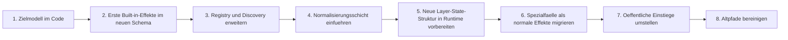

# Implementierungsplan

Diese Datei zerlegt den Umbau in kleine, sinnvoll testbare Zwischenschritte.

## Leitregel

Jeder Schritt soll:

- einen klaren technischen Fokus haben
- lokal testbar sein
- moeglichst wenig bestehende Funktionalitaet gleichzeitig beruehren
- eine saubere Rueckfallgrenze besitzen

## Gesamtuebersicht

## Schritt 1: Zielmodell im Code

Ziel:

- neue Enums
- neue Dataclasses
- `BaseEffect`
- `EffectRegistry`
- Grundvalidierung

Testbar durch:

- reine Unit-Tests ohne Runtime-Eingriff
- Registry-Discovery aus Testmodulen

Abschlusskriterium:

- neue Modellbausteine existieren stabil neben der Altarchitektur

Status:

- abgeschlossen

## Schritt 2: Erste Built-in-Effekte im neuen Schema

Ziel:

- 2 bis 4 einfache Effektklassen im neuen Modell anlegen
- z. B. `off`, `solid_color`, `soft_pulse`, `warning_flash`

Testbar durch:

- Unit-Tests fuer `render(ctx)`
- Validierung von Layer-Regeln und Defaults

Abschlusskriterium:

- mindestens ein State-Effekt und ein Event-Effekt laufen im neuen Schema

Status:

- abgeschlossen

## Schritt 3: Registry und Discovery erweitern

Ziel:

- Built-in-Registrierung zentralisieren
- optionalen Library-Path-Reload erweitern
- klare Fehlermeldungen fuer Discovery-Konflikte

Testbar durch:

- tmp-Pfade mit Testbibliotheken
- Duplicate-ID-Fehler
- Reload-Verhalten

Abschlusskriterium:

- Engine kann Built-in- und externe Effektklassen konsistent sehen

Status:

- abgeschlossen

## Schritt 4: Normalisierungsschicht einfuehren

Ziel:

- neues `NormalizedCommand` wirklich benutzen
- erster Normalizer fuer einfache Set-/Clear-Kommandos

Testbar durch:

- reine Mapping-Tests
- CLI/API-unabhaengige Unit-Tests

Abschlusskriterium:

- ein fachlicher Befehl wird zu einer validen `EffectInvocation`

Status:

- abgeschlossen

## Schritt 5: Neue Layer-State-Struktur in Runtime vorbereiten

Ziel:

- bestehende Runtime schrittweise auf neue Layer-IDs vorbereiten
- neue `LayerState`-Struktur einfuehren, zunaechst parallel oder adapterbasiert

Testbar durch:

- Runtime-Status-Tests
- Composer-/Renderer-Tests

Abschlusskriterium:

- Runtime kann den neuen Layerzustand intern abbilden, ohne die Altpfade sofort abzureissen

Status:

- abgeschlossen

## Schritt 6: Spezialfaelle als normale Effekte migrieren

Ziel:

- `direction`
- `countdown`
- `progress`
- spaetere Sonderfaelle

werden als normale Effektklassen abgebildet

Testbar durch:

- Effekt-Render-Tests
- Queue-/Layer-Regel-Tests
- Runtime-Integrationstests

Abschlusskriterium:

- diese Faelle haben keine eigene Runtime-Sonderlogik mehr noetig

Status:

- abgeschlossen

## Schritt 7: Oeffentliche Einstiege umstellen

Ziel:

- CLI
- API
- Adapter
- Komfort-APIs

sprechen intern nicht mehr direkt alte Spezialpfade an, sondern die neue Normalisierung

Testbar durch:

- API-Tests
- CLI-Tests
- Adapter-Tests

Abschlusskriterium:

- alle Eingabeformen landen auf derselben inneren Kommandoschicht

Status:

- abgeschlossen

## Schritt 8: Altpfade bereinigen

Ziel:

- nicht mehr benoetigte Parallelpfade abbauen
- Doku konsolidieren
- Migrationsreste entfernen

Testbar durch:

- Gesamtsuite
- Architekturtests
- Smoke-Tests

Abschlusskriterium:

- nur noch eine offizielle Ausfuehrungs-Engine bleibt uebrig

Status:

- abgeschlossen

## Abschlussstand

- Alle Schritte 1 bis 8 sind im Code umgesetzt.
- Registry, Normalisierung, Runtime, Spezialfallmigration und oeffentliche Einstiege laufen ueber dieselbe Invocation-basierte Engine.
- Event-Queue arbeitet mit `priority + FIFO`, ohne das laufende Event zu preempten; die Laufzeit startet erst bei Aktivierung.
- Der Abschluss ist durch die Gesamtsuite bestaetigt.

## Finales Test-Gate

- fokussierte Core-Tests fuer Built-ins, Registry, Normalisierung, Composer und Runtime
- angrenzende Regression fuer API, CLI, Client, Service, STT, Presets und Renderer
- Gesamtsuite mit `pytest -q --basetemp=.pytest_tmp`

Ergebnis:

- `221 passed`
