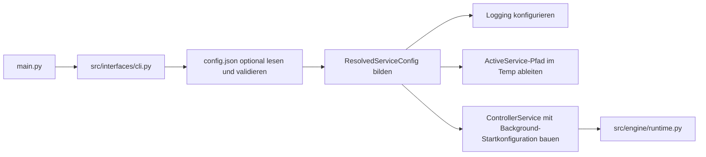

# Integrationskonzept Fuer Optionale config.json Und Release-Runtime-Pfade

Stand: 2026-04-12
Status: Planungsdokument, keine Implementierung in diesem Konzeptteil

## Ziel

Dieses Dokument beschreibt ein konsistentes Integrationskonzept fuer drei zusammenhaengende Neuerungen:

- optionale read-only `config.json`
- Ablage von `active_service.json` im Temp-Verzeichnis statt unter `runtime_state/`
- Wegfall von `background_state.json` als Laufzeitdatei zugunsten eines optionalen `background_state`-Blocks in `config.json`

Ziel ist ausdruecklich nicht, die bestehende Architektur zu umgehen, sondern die Neuerung in denselben zentralen Start- und Verantwortlichkeitspfad einzubauen, den das Projekt heute bereits fuer CLI, API, Service und Runtime nutzt.

## Projektueberblick Und Relevanter Ist-Zustand

Das Repo ist heute bereits klar auf einen einzigen offiziellen Betriebsweg ausgerichtet:

- `main.py` delegiert nach `src/interfaces/cli.py`
- `src/interfaces/cli.py` ist der alleinige oeffentliche Startpfad fuer `serve`
- `src/interfaces/api.py` baut die FastAPI-App und haengt `ControllerService` an den App-State
- `src/services/service.py` kapselt den laufenden Service, Restore-Logik und Render-Loop
- `src/engine/runtime.py` ist der fachliche Kern fuer Layer, Commands, Effekte und Status
- `src/infrastructure/paths.py` definiert heute die festen Datei- und Verzeichnispfade
- `src/infrastructure/logging_utils.py` konfiguriert aktuell das globale Basislogging
- `src/infrastructure/background_state_store.py` liest und schreibt heute `background_state.json`
- `src/services/service_hosting.py` verwaltet heute `active_service.json`

Wichtig fuer die neue Planung:

- Der Service besitzt bereits genau einen offiziellen Startpfad.
- `BACKGROUND_STATE_LAYER` hat heute eine explizite Restore-/Persistenzstrecke.
- `active_service.json` ist heute bereits als technische Runtime-Metadatei isoliert.
- Logging ist heute bewusst einfach und global gehalten.

Das ist eine gute Ausgangslage, weil die neue Konfiguration nicht ueber viele Schichten verteilt werden muss. Sie sollte genau einmal am Start aufgeloest und dann gezielt in die betroffenen Komponenten injiziert werden.

## Leitprinzipien Fuer Die Integration

- `config.json` ist optional. Fehlt die Datei, bleibt das heutige Verhalten vollstaendig erhalten.
- `config.json` ist read-only. Der Service erstellt, aktualisiert oder migriert diese Datei nicht.
- Fehlende Abschnitte oder fehlende Eintraege bedeuten immer: bestehender Default greift weiter.
- Konfiguration wird zentral beim Service-Start gelesen, validiert und in ein aufgeloestes Laufzeitmodell ueberfuehrt.
- Tiefe Module lesen `config.json` nicht selbst von der Platte.
- Schreibbare Runtime-Daten und read-only Startkonfiguration werden sauber getrennt.
- `runtime_state/` soll fuer Release kein kanonischer Laufzeitpfad mehr sein.
- Die bestehende Service-, Runtime- und Layer-Semantik bleibt unangetastet; die Neuerung steuert nur Startdefaults und Logging-Gates.

## Zielbild

Nach der spaeteren Umsetzung soll der Startpfad logisch so aussehen:



Kernidee:

- `config.json` beeinflusst nur den Start und optionales Detail-Logging.
- Der laufende Service arbeitet danach wie bisher ueber `ControllerService` und `ControllerRuntime`.
- Es gibt keinen versteckten Dateizugriff aus der Runtime heraus auf `config.json`.

## Geplantes Konfigurationsmodell

Die Datei liegt implizit neben der Anwendung unter:

```text
APP_ROOT/config.json
```

Dabei gilt bereits heute:

- im Dev-Betrieb ist `APP_ROOT` effektiv das Projektwurzelverzeichnis
- im gepackten Betrieb ist `APP_ROOT` das Verzeichnis der ausfuehrbaren Datei

Damit bleibt der Mechanismus in Dev und Release konsistent, ohne einen zweiten Suchpfad einzufuehren.

## Geplantes JSON-Schema

Das externe JSON-Schema soll bewusst klein bleiben:

```json
{
  "background_state": {
    "effect_id": "rotating_segment",
    "enabled": true,
    "layer_id": "BACKGROUND_STATE_LAYER",
    "params": {
      "color": "FFFFFF",
      "brightness": 0.2,
      "speed": 9,
      "segment_length": 3
    }
  },
  "logging": {
    "log_file": "P:\\CodexApp\\led_controller_respeaker\\logs\\led_controller.log",
    "engine_commands": true,
    "api_calls": true
  }
}
```

Geplante Semantik:

- Der gesamte `background_state`-Block ist optional.
- Der gesamte `logging`-Block ist optional.
- Jeder einzelne Eintrag innerhalb dieser Bloecke ist optional.
- Nicht gesetzte Booleans im `logging`-Block bedeuten `false`.
- Nicht gesetzte Werte im `background_state`-Block fallen auf ein internes Defaultmodell zurueck.

## Internes Zielmodell

Die JSON-Datei sollte nicht lose als `dict` durch das System gereicht werden. Sinnvoll ist ein kleines internes Konfigurationsmodell, zum Beispiel:

- `ResolvedServiceConfig`
- `BackgroundStateConfig | None`
- `LoggingConfig`

Dieses Modell wird genau einmal aus JSON aufgebaut und danach an die relevanten Stellen uebergeben.

Wichtig ist die Trennung:

- JSON-Parsing und Validierung in `infrastructure`
- Startentscheidungen in `interfaces/cli.py`
- Service-Verhalten in `services/service.py`
- Effektanwendung weiter in `engine/runtime.py`

## Konzept Fuer background_state

## Heutiger Zustand

Heute passiert Folgendes:

- `ControllerService` liest beim Start `runtime_state/background_state.json`
- gueltige Daten werden via `runtime.restore_persisted_background_state(...)` wiederhergestellt
- bei fehlender oder ungueltiger Datei wird `apply_default_background_state()` verwendet
- waehrend des Betriebs wird der aktuelle Background-State wieder in `background_state.json` zurueckgeschrieben

## Neuer Zielzustand

Kuenftig passiert stattdessen Folgendes:

- Es gibt keine kanonische Datei `background_state.json` mehr.
- Der Service speichert keinen Background-State mehr auf Platte.
- Falls `config.json` einen `background_state`-Block enthaelt, wird dieser beim Start angewendet.
- Falls kein `background_state` konfiguriert ist, greift wie bisher der interne Default-Background als Fallback.

Das bedeutet bewusst:

- Background-State ist kein vom Service persistierter Runtime-Zustand mehr.
- Background-State ist fuer den Start eine deklarative Vorgabe aus der Konfiguration.
- Laufende API- oder CLI-Aenderungen am Background-Layer bleiben moeglich, ueberleben aber einen Neustart nicht mehr automatisch.

## Empfohlene Prioritaetsregel

Die Startlogik fuer den Hintergrund sollte spaeter strikt so sein:

1. Falls `config.json` fehlt oder kein `background_state` vorhanden ist: internen Default-Background anwenden.
2. Falls `config.json.background_state` vorhanden und `enabled=false` ist: keinen Background-Startzustand anwenden.
3. Falls `config.json.background_state` vorhanden und aktiv ist: konfigurierten Background anwenden.

Diese Regel ist wichtig, damit eine explizite Konfiguration nicht still wieder vom eingebauten Fallback ueberschrieben wird.

## Defaultmodell Fuer Partielle background_state-Konfiguration

Damit wirklich jeder Eintrag optional sein kann, sollte intern nicht direkt gegen ein "alles oder nichts"-Schema validiert werden, sondern gegen ein Defaultmodell:

```text
effect_id = "solid_color"
enabled = true
layer_id = "BACKGROUND_STATE_LAYER"
params = {"color": "#FFFFFF", "brightness": 0.2}
```

Danach werden vorhandene Konfigurationswerte daruebergelegt.

Vorteile:

- Das Verhalten bleibt kompatibel zum heutigen Start-Fallback.
- Partielle Konfigurationen sind moeglich.
- Die Datei bleibt klein und ergonomisch.

Wichtig:

- `layer_id` soll nur `BACKGROUND_STATE_LAYER` akzeptieren.
- Ein konfigurierter Effekt muss weiterhin normal gegen Registry und Parameterregeln validiert werden.
- Die Konfiguration darf keine Sonderpfade an der Runtime vorbei einfuehren.

## Konsequenz Fuer Die Architektur

`background_state_store.py` sollte langfristig nicht zu einem halb umfunktionierten "config + store"-Hybrid verbogen werden.

Sauberer ist:

- ein dedizierter `config_loader.py` fuer `config.json`
- eine kleine fachliche Validierung fuer `BackgroundStateConfig`
- die eigentliche Anwendung weiter ueber `ControllerService` und `ControllerRuntime.apply_effect(...)`

Wenn vorhandene Hilfslogik aus `background_state_store.py` wiederverwendbar ist, sollte sie in neutrale Parse-/Validate-Helfer extrahiert werden, statt den Modulnamen "store" fuer eine read-only Konfiguration weiterzuschleppen.

## Konzept Fuer active_service.json Im Temp-Verzeichnis

## Heutiger Zustand

Heute liegt `active_service.json` unter:

```text
APP_ROOT/runtime_state/active_service.json
```

Die Datei wird genutzt fuer:

- PID der laufenden Instanz
- Host und Port
- Rueckkanal fuer Host-Anwendungen bei Portpool-Fallback
- Uebernahme und Shutdown einer alten Instanz

## Neuer Zielzustand

Kuenftig liegt `active_service.json` unter einem stabilen app-spezifischen Temp-Pfad, zum Beispiel:

```text
%TEMP%/led_controller_respeaker/active_service.json
```

Wichtig ist nicht der exakte Unterordnername, sondern diese Regel:

- Die Datei liegt in einem beschreibbaren Temp-Verzeichnis.
- Das Verzeichnis ist app-spezifisch.
- Der Pfad wird zentral in `paths.py` abgeleitet.

## Warum Temp Hier Der Richtige Ort Ist

- `active_service.json` ist reine Laufzeitmetadaten-Datei.
- Die Datei ist fluechtig und darf bei Prozessende oder Systembereinigung verschwinden.
- Sie gehoert nicht ins Release-Installationsverzeichnis.
- Sie ist keine fachliche Konfiguration und keine Nutzerdatei.

## Abgrenzung Zu config.json

- `config.json` ist deklarativ, optional und read-only.
- `active_service.json` ist technisch, fluechtig und writeable.

Gerade diese Trennung sollte im Code spaeter sichtbar bleiben.

## Konzept Fuer Logging-Erweiterung

## Heutiger Zustand

Heute kennt `setup_logging(...)` im Wesentlichen:

- Logdatei
- Log-Level
- optionalen Console-Handler

Alle Logger laufen unter dem Namensraum `led_controller.*`.

## Neuer Zielzustand

Zusaetzlich soll `config.json.logging` gezielt Detail-Logging fuer einzelne fachliche Bereiche aktivieren koennen.

Regeln:

- Jeder Bereich ist optional.
- Nicht gesetzte Bereiche sind `false`.
- Basislogging fuer Fehler, Warnungen und Lebenszyklus bleibt auch ohne Detail-Flags erhalten.
- Die Flags schalten zusaetzliche diagnostische Logeintraege frei, nicht das gesamte Logging-System an oder aus.

## Empfohlene Form Der Logging-Integration

Die Bereichsflags sollten nicht ueber Logger-Level modelliert werden, weil sie fachliche Kategorien und keine Schweregrade abbilden.

Stattdessen ist fuer spaeter empfohlen:

- `LoggingConfig` enthaelt `log_file` plus `enabled_areas`
- `logging_utils.py` bekommt zusaetzlich eine kleine Abfragehilfe wie `is_log_area_enabled("api_calls")`
- betroffene Stellen loggen Zusatzdetails nur noch hinter solchen Gates

Beispielhafte erste Bereiche:

- `api_calls`
- `engine_commands`
- `service_hosting`
- `background_state`
- `adapter_fallback`

Die konkrete Liste sollte sich an realen Verantwortlichkeiten der bestehenden Module orientieren, nicht an beliebigen Wunschlabels.

## Wichtig Fuer Konsistenz

Das bestehende `logger = get_logger("...")`-Muster sollte erhalten bleiben.

Die Erweiterung sollte nur diese Schicht dazusetzen:

- normales Logger-Objekt fuer allgemeines Logging
- kleine Zusatz-Gates fuer optionale Diagnosebereiche

So bleibt das Projekt beim heutigen Logging-Stil und fuehrt kein zweites konkurrierendes Logging-System ein.

## Validierungs- Und Fehlerverhalten

Fuer die spaetere Implementierung ist folgende Linie konsistent:

- fehlende `config.json`: kein Fehler, heutiges Verhalten
- vorhandene, aber syntaktisch ungueltige JSON-Datei: Startfehler mit klarer Meldung
- vorhandene, aber semantisch ungueltige Werte: Startfehler mit klarer Meldung
- unbekannte Logging-Booleans: entweder explizit validieren und Fehler werfen oder bewusst mit Warnung ignorieren; diese Entscheidung sollte einheitlich getroffen werden

Empfehlung:

- bekannte Struktur streng validieren
- keine stillen Tippfehler in Schluesseln akzeptieren

Das ist strenger, aber betrieblich sauberer und besser debugbar.

## Konkrete Integrationspunkte Im Code

## 1. `src/infrastructure/paths.py`

Geplante Richtung:

- `CONFIG_FILE = APP_ROOT / "config.json"`
- `ACTIVE_SERVICE_FILE` nicht mehr unter `runtime_state`, sondern unter einem Temp-Unterordner
- `BACKGROUND_STATE_FILE` entfernen oder zumindest nicht mehr produktiv verwenden
- `RUNTIME_STATE_ROOT` nicht mehr als kanonischen Release-Pfad behandeln

## 2. Neuer Loader in `src/infrastructure/`

Empfohlenes neues Modul:

- `src/infrastructure/config_loader.py`

Verantwortung:

- Datei optional finden
- JSON lesen
- in `ResolvedServiceConfig` umwandeln
- Defaulting und Validierung kapseln

## 3. `src/interfaces/cli.py`

Das ist der richtige Ort fuer:

- optionales Laden der Konfiguration beim `serve`-Start
- Aufruf von `setup_logging(...)` mit konfigurierter Logdatei
- Weitergabe des aufgeloesten Konfigurationsmodells an `create_app(...)`
- Nutzung des Temp-Pfads fuer `active_service.json`

Wichtig:

- Konfigurationsauflosung genau einmal im Startpfad
- keine spaetere Neuladung im laufenden Betrieb

## 4. `src/interfaces/api.py`

`create_app(...)` sollte keine Dateipfade selbst kennen.

Stattdessen sollte die Funktion spaeter genau die bereits aufgeloesten Laufzeitwerte entgegennehmen, zum Beispiel:

- `service_config`
- oder explizit `background_state_config` plus weitere benoetigte Werte

## 5. `src/services/service.py`

Hier sollte die Background-Startlogik fachlich bleiben, aber nicht mehr dateibasiert sein.

Empfohlene Richtung:

- bisherige Restore-/Save-Strecke fuer `background_state.json` entfernen
- stattdessen eine kleine Startentscheidung anhand von `BackgroundStateConfig | None`
- keine Hintergrund-Persistenz mehr waehrend des Betriebs

## 6. `src/services/service_hosting.py`

Die Fachlogik fuer `active_service.json` kann weitgehend bleiben.

Geaendert wird nur:

- der Pfad kommt nicht mehr aus `runtime_state/`
- die Datei wird kuenftig als Temp-Metadatei behandelt

## 7. `src/infrastructure/logging_utils.py`

Geplante Erweiterungen:

- `setup_logging(...)` soll `log_file` weiterhin zentral konfigurieren
- zusaetzliche Speicherung der aktivierten Logging-Bereiche
- kleine Hilfsfunktion fuer bereichsgebundene Detail-Logs

## Bewusst Nicht Geplant

Folgendes sollte in dieser Neuerung nicht vermischt werden:

- kein dynamisches Reloading von `config.json`
- keine Runtime-Schreibzugriffe auf `config.json`
- keine neue oeffentliche API-Route fuer Konfigurationsverwaltung
- keine Ausweitung der Konfiguration auf Port, Host, FPS oder Device-Mode in demselben Schritt, solange das nicht bewusst beschlossen wurde

Das haelt den Eingriff klein und koharent.

## Migrationsstrategie

Sinnvolle spaetere Reihenfolge:

1. `ResolvedServiceConfig` und Loader einfuehren.
2. `paths.py` auf `CONFIG_FILE` und Temp-`ACTIVE_SERVICE_FILE` umstellen.
3. Logging-Konfiguration zentral ueber den Startpfad verdrahten.
4. Background-Startlogik von Dateipersistenz auf read-only Konfiguration umstellen.
5. Altpfad `runtime_state/background_state.json` entfernen.
6. Doku und Tests auf das neue Startmodell aktualisieren.

Diese Reihenfolge reduziert Risiko, weil zuerst die zentrale Konfigurationsauflosung steht und danach die einzelnen Verbraucher umgestellt werden.

## Testkonzept Fuer Die Spaetere Umsetzung

## Unit-Tests

- Loader: Datei fehlt
- Loader: JSON syntaktisch ungueltig
- Loader: partielle `background_state`-Konfiguration
- Loader: partielle `logging`-Konfiguration
- Loader: ungueltige `layer_id`
- Loader: unbekannte Logging-Schluessel

## Service-Tests

- ohne `config.json` greift der bestehende Default-Background
- mit `background_state` aus Konfiguration startet der Service mit konfiguriertem Background
- mit `enabled=false` wird kein Background-Startzustand gesetzt
- es wird kein `background_state.json` mehr geschrieben

## Hosting-Tests

- `active_service.json` wird im Temp-Pfad geschrieben
- Laden, Aktualisieren und Entfernen funktionieren unveraendert
- Takeover funktioniert weiter mit dem neuen Pfad

## Logging-Tests

- ohne Bereichsflags werden keine Zusatzlogs erzeugt
- mit `api_calls=true` erscheinen API-Diagnoselogs
- mit `engine_commands=true` erscheinen Runtime-/Command-Diagnoselogs
- `log_file` aus Konfiguration wird verwendet

## Regressionen

- CLI-Serve-Start funktioniert ohne Konfigurationsdatei unveraendert
- API- und Client-Schnittstellen bleiben unveraendert
- Architekturtests bleiben gruendlich frei von neuen Parallelpfaden

## Auswirkungen Auf Doku Und Release

Die bestehende Doku muss spaeter an genau diesen Punkten angepasst werden:

- README: keine Referenzen mehr auf `runtime_state/background_state.json`
- README und Deployment-Doku: `active_service.json` im Temp-Verzeichnis dokumentieren
- `docs/current_approach.md`: Background-State nicht mehr als Runtime-Persistenz, sondern als Startkonfiguration beschreiben
- `docs/dev/runtime_layers.md`: Persistenzbeschreibung fuer `BACKGROUND_STATE_LAYER` auf Startkonfiguration umstellen
- Release-Struktur: `runtime_state/` nicht mehr als erwarteten Ordner auffuehren

## Offene Entscheidungsfragen

Vor der Umsetzung sollten diese Punkte einmal explizit bestaetigt werden:

- Soll `enabled=false` im `background_state`-Block bewusst den Default-Fallback unterdruecken?
- Sollen unbekannte Logging-Schluessel hart fehlschlagen oder nur warnen?
- Soll der Temp-Unterordnername fix `led_controller_respeaker` sein oder bewusst neutraler benannt werden?

## Empfehlung

Die neue Funktion sollte als Startkonfigurations-Erweiterung umgesetzt werden, nicht als zweite Persistenzstrecke.

Der sauberste Weg ist:

- eine kleine zentrale `config.json`-Loader-Schicht
- ein internes aufgeloestes Konfigurationsmodell
- Temp-basierte `active_service.json`
- keine gespeicherte `background_state.json` mehr
- bereichsgebundene Logging-Gates auf Basis derselben Konfiguration

So bleibt die Architektur beim bestehenden Muster:

- ein Startpfad
- eine Runtime
- klare Trennung zwischen read-only Konfiguration und writeable Laufzeitdaten
- keine "reingeflickte" Sonderlogik in tiefen Modulen


Zu den offenen Fragen:
- es wird bereits der Ordner "respeaker_led_controller_runtime_state" im TEMP-Verzeichnis erstellt für temporäre/Laufzeit-Dateien. Dieser wird momentan genutzt für 
- 1. effect_package_cache (soll unverändert bestehen bleiben.) 
- 2. active_service.json (wird ebenfalls weiterhin benötigt, um zu prüfen ob bereits eine andere Instanz läuft)
- 3. background_state.json (Können wir eigentlich doch so beibehalten als zwischen-fallback... Sollte der background_state inn der config.json festgelegt werden, hat dieser klaren Vorrang. Wenn dort enabled=false festgelegt wird, ist das ebenfalls eine Festlegung und aufgrund des Vorranges ist diese dann auch gültig. Die logische Folge: Kein Fallback, background layer wird deaktiviert. )