# Konzept DoA Integration und Template

## Ziel

Es soll ein wiederverwendbares Effekt-Template entstehen, das echte DoA-Werte des reSpeaker verarbeitet und daraus eine eigene LED-Visualisierung ableitet.

Dabei soll die Umsetzung:

- zum aktuellen Service- und Effekt-System passen
- die bestehenden Layer-, Registry- und Build-Prinzipien respektieren
- **nicht** den eingebauten reSpeaker-LED-DoA-Modus verwenden
- als normale Effekt- und Service-Erweiterung in die bestehende Architektur eingebettet werden

## Ist-Bild im aktuellen System

### Effekt-System

- Die Runtime rendert ausschliesslich normale Effekte ueber `EffectDefinition`, `EffectInvocation`, `SceneComposer` und `SceneRenderer`.
- Die Standard-Effekte werden nicht direkt aus losen Quelldateien geladen, sondern als vorgebaute `.lefx`- und `.lefxset`-Artefakte.
- Die Buildquellen liegen aktuell unter `tools/effect_building/effect_definitions/`.
- Das veroeffentlichte Default-Bundle ist `src/led_effects/effects/default-effects.lefxset`.

### Richtungs-Logik heute

- Es gibt bereits einen normalen Overlay-Effekt `direction_indicator`.
- `ControllerRuntime.set_direction()` schreibt die Richtung in den Store und erzeugt ueber den Normalizer eine normale Effekt-Invocation auf `ONGOING_OVERLAY_LAYER`.
- Damit ist die Architektur-Richtung bereits klar: Richtung ist heute **kein Sonderpfad im Renderer**, sondern ein normaler Effekt auf einem normalen Layer.

### Service- und Hardware-Anbindung heute

- Der Service besitzt bereits einen eigenen Render-Thread.
- Der eigentliche Hardwarezugriff liegt im `ReSpeakerAdapter`.
- Fuer LED-Ausgabe wird der Adapter in den Ring-Modus geschaltet und schreibt dann pro Frame `LED_RING_COLOR`.
- Ein DoA-Lesebeispiel liegt in `src/python_control/respeaker_get_doa.py`.
- `src/python_control/xvf_host.py` kennt mehrere Richtungsquellen.
- Hardwarevalidierung vom 2026-04-14: `DOA_VALUE` blieb auf dem echten Geraet bei Live-Tests festhaengend, waehrend `AUDIO_MGR_SELECTED_AZIMUTHS` deutlich reagierte.
- Fuer die produktive Integration sollte deshalb primaer `AUDIO_MGR_SELECTED_AZIMUTHS` verwendet werden:
  - Index `0`: verarbeiteter Sprecher-Azimut, kann `NaN` sein, wenn keine verwertbare Sprecher-Richtung vorliegt
  - Index `1`: Auto-Select-Beam-Azimut als Roh-Fallback
- `DOA_VALUE` eignet sich hoechstens noch als Kompatibilitaets-Fallback fuer Firmware-Varianten, bei denen der Azimut-Kanal nicht verfuegbar ist.

## Klare Empfehlung in Kurzform

1. **DoA nicht im Effekt selbst abfragen**, sondern im Service-/Adapter-Bereich.
2. **Keinen eigenen Unterprozess** dafuer starten.
3. **ReSpeakerAdapter um eine lesende DoA-Methode erweitern**.
4. **DoA-Abfrage im bestehenden Service-Lebenszyklus seriell mit dem Rendern koppeln**, damit es keine konkurrierenden USB-Zugriffe gibt.
5. **Ein neues normales Effekt-Template** fuer DoA-Visualisierung einfuehren, das nur noch vorbereitete Parameter rendert.
6. **Das Template auf `ONGOING_OVERLAY_LAYER` integrieren**, weil diese Schicht bereits die Richtung-/Overlay-Semantik traegt.
7. **Style- und Zustandslogik im Effekt kapseln**, Sensorabfrage und Aktualisierung aber ausserhalb des Effekts halten.

## Empfohlene Zielarchitektur

```mermaid
flowchart LR
    A["ReSpeakerAdapter.read_doa_snapshot()"] --> B["ControllerService DoA polling"]
    B --> C["ControllerRuntime.set_doa_snapshot(...)"]
    C --> D["ControllerCommandNormalizer"]
    D --> E["DoA Template Invocation on ONGOING_OVERLAY_LAYER"]
    E --> F["SceneComposer"]
    F --> G["SceneRenderer"]
    G --> H["ReSpeakerAdapter.apply_frame(...)"]
```

## Integration in den bestehenden Code

### 1. Neue DoA-Datenstruktur einfuehren

Empfohlen ist ein kleines internes Snapshot-Modell, zum Beispiel fachlich in dieser Form:

- `direction_deg: float | None`
- `speech_detected: bool`
- `sound_detected: bool`
- `source_available: bool`
- `updated_at: float`

Wichtig:

- `direction_deg` ist nur gesetzt, wenn ein gueltiger Richtungswert vorliegt.
- `speech_detected` kommt direkt aus dem reSpeaker-Read.
- `sound_detected` ist die fachliche Betriebsentscheidung:
  - `True`, wenn eine DoA-Richtung vorliegt
  - `False`, wenn keine verwertbare Erkennung vorliegt

Damit koennen die drei benoetigten Zustaende sauber modelliert werden:

1. **Keine Erkennung**
   - `sound_detected = False`
   - `speech_detected = False`
   - `direction_deg = None`
2. **Geraeusch erkannt**
   - `sound_detected = True`
   - `speech_detected = False`
   - `direction_deg` gesetzt
3. **Sprache erkannt**
   - `sound_detected = True`
   - `speech_detected = True`
   - `direction_deg` gesetzt

### 2. ReSpeakerAdapter erweitern

Ja, der `ReSpeakerAdapter` sollte erweitert werden.

Empfohlene Richtung:

- `read_doa_snapshot()` oder `read_direction_snapshot()`

Diese Methode sollte:

- primaer `AUDIO_MGR_SELECTED_AZIMUTHS` ueber das bereits genutzte `xvf_host.py` lesen
- den verarbeiteten Sprecher-Azimut bevorzugen und nur bei Bedarf auf den Auto-Select-Beam oder einen Legacy-Fallback ausweichen
- die Rohdaten in ein kleines internes Snapshot-Objekt uebersetzen
- keine LED-Ausgabe ausloesen
- keine Endlosschleife enthalten
- Fehler kontrolliert behandeln und bei Lesefehlern einen neutralen Snapshot oder eine Exception liefern

Das ist architektonisch sauberer als:

- ein separater Hilfsprozess
- direkter USB-Zugriff aus dem Effekt
- eine zweite unkoordinierte Hardware-Schnittstelle ausserhalb des Adapters

### 3. Service-seitiges Polling statt Effekt-seitiger Logik

Die DoA-Abfrage sollte im `ControllerService` oder in einer kleinen, direkt dort verankerten Hilfskomponente passieren.

Empfehlung:

- Polling innerhalb des bestehenden Service-Kontextes
- Ausfuehrung unter demselben Lock, unter dem auch Rendering und Mutationen laufen
- danach Uebergabe des Snapshots an die Runtime

Praktisch heisst das:

- zuerst DoA lesen
- dann Runtime/Layer aktualisieren
- danach denselben Render-Tick fertig rendern und ans Geraet schreiben

So bleibt die Hardware-Kommunikation seriell und kontrolliert.

### 4. Runtime um einen fachlichen DoA-Einstieg erweitern

Empfohlen ist ein eigener Runtime-Einstieg, nicht nur ein Wiederverwenden von `set_direction(float)`.

Empfehlung:

- `set_doa_snapshot(snapshot)`
- optional `clear_doa_snapshot()`

Begruendung:

- `set_direction()` deckt nur die Zahl ab, aber nicht die drei benoetigten Zustaende.
- Fuer das Template werden zusaetzliche Informationen benoetigt:
  - keine Erkennung
  - Geraeusch erkannt
  - Sprache erkannt
- Dadurch bleibt die DoA-Fachlichkeit sauber gekapselt und muss nicht ueber lose Zusatzparameter an vielen Stellen nachgebaut werden.

### 5. Normalizer und Layer-Nutzung

Die Runtime sollte aus dem Snapshot weiterhin eine **normale Effekt-Invocation** machen.

Empfohlene Integration:

- Ziel-Layer: `ONGOING_OVERLAY_LAYER`
- Effekt-ID: neues DoA-Template, zum Beispiel `doa_activity_indicator`
- Parameter:
  - `direction`
  - `detection_state`
  - optionale Template-/Style-Overrides

Das passt gut zur heutigen Architektur, weil `ONGOING_OVERLAY_LAYER` bereits in `get_status()` als `direction_visual` gefuehrt wird.

## Braucht die Logik einen eigenen Unterprozess?

**Empfehlung: nein.**

Ein eigener Unterprozess ist fuer diesen Anwendungsfall nicht noetig und waere eher ein Nachteil.

### Warum kein Unterprozess?

- Der Service besitzt bereits einen dauerhaften Lebenszyklus.
- Der Service hat bereits einen Render-Thread.
- Der Adapter besitzt bereits den exklusiven Hardware-Zugriff.
- Ein weiterer Prozess wuerde USB-Zugriffe und Zustandssynchronisation unnoetig komplizieren.

### Risiken eines Unterprozesses

- doppelte oder konkurrierende Device-Zugriffe
- kompliziertere Fehlerbehandlung
- Synchronisationsbedarf zwischen Prozess und Service
- erhoehte Latenz fuer Statusuebergaben
- unnoetige Betriebs- und Deployment-Komplexitaet

### Bessere Alternative

- DoA-Polling als Teil des laufenden Service
- keine zweite Runtime
- keine zweite Ownership des USB-Geraets

## Risiko paralleler Effekte der Engine

### Kurzantwort

Ja, ein Konfliktrisiko besteht, wenn mehrere Effekte denselben Layer gleichzeitig nutzen wollen.

### Konkreter Konflikt im heutigen Modell

Ausser dem `EVENT_LAYER` besitzt jeder normale Layer genau **eine** aktive Invocation.

Das bedeutet:

- Ein DoA-Template auf `ONGOING_OVERLAY_LAYER` ersetzt andere laufende Overlays auf demselben Layer.
- Umgekehrt kann ein anderes Overlay das DoA-Template verdraengen.

### Bewertung

Das ist kein spezielles DoA-Problem, sondern das normale Verhalten der aktuellen Engine.

### Empfehlung fuer Release 1 dieser Funktion

- DoA bewusst als **den** laufenden Richtungs-/Tracking-Overlay-Effekt auf `ONGOING_OVERLAY_LAYER` behandeln
- keine neue Layer-Kategorie nur fuer DoA einfuehren
- klar dokumentieren, dass parallele laufende Overlays auf derselben Schicht nicht kombiniert werden

### Falls spaeter Parallelitaet erforderlich wird

Dann gibt es aus heutiger Sicht drei saubere Optionen:

1. ein gemeinsamer zusammengesetzter Overlay-Effekt
2. ein bewusst erweitertes Layer-Modell
3. eine vorgelagerte fachliche Komposition, bevor die Invocation erzeugt wird

Fuer den aktuellen Umfang ist Option 1 oder das bestehende Single-Overlay-Modell klar vorzuziehen.

## Empfohlenes Effekt-Template

### Ziel des Templates

Das Template soll die komplette LED-Verteilungslogik fuer DoA kapseln, waehrend die Live-Daten von aussen geliefert werden.

Das Template soll also:

- DoA-Winkel in LED-Positionen uebersetzen
- die drei Zustande unterscheiden
- `direction_led`, `wing_leds` und `background` aufbauen
- Fallbacks fuer teilweise gesetzte Konfigurationen aufloesen

Das Template soll **nicht**:

- selbst USB lesen
- selbst pollen
- eigene Threads oder Schleifen starten

### Vorgeschlagene Effekt-ID

- `doa_activity_indicator`

### Vorgeschlagener Einbauort

- neue Datei `tools/effect_building/effect_definitions/doa.py`

oder alternativ:

- fachlich passend in `overlays.py`

Empfehlung:

- eigene Datei `doa.py`, weil die Logik fachlich eigenstaendig ist und voraussichtlich wachsen wird

Danach:

- in `tools/effect_building/standard_effects.py` in `_MODULE_BUNDLES` aufnehmen
- mit dem bestehenden LEFX-/LEFXSET-Build in `default-effects.lefxset` uebernehmen

## Template-Parameterbild

### Laufzeitdaten

Diese Parameter kommen typischerweise aus der Runtime:

- `direction`
- `detection_state`

Empfohlene Werte fuer `detection_state`:

- `none`
- `sound`
- `speech`

### Template-Konfiguration

Empfohlen sind zusaetzlich:

- `angle_offset_deg`
  - zur Kalibrierung der physischen Ringausrichtung
- `reverse_ring`
  - falls die logische Drehrichtung invertiert werden muss
- `wing_count`
  - `0` = keine Fluegel
  - `1` = je Seite eine zusaetzliche LED
  - usw.

### Style-Bloecke

Empfohlen ist eine verschachtelte Style-Struktur mit Defaults und optionalen State-Overrides.

Beispielhaft fachlich:

- `defaults`
  - `direction_led`
  - `wing_leds`
  - `background`
- `states`
  - `none`
  - `sound`
  - `speech`

Jeder State-Block darf dann optional enthalten:

- `direction_led`
- `wing_leds`
- `background`

Die Aufloesung soll so funktionieren:

1. state-spezifischer Bereich
2. allgemeiner Bereich aus `defaults`
3. harter technischer Effekt-Default

## Empfohlenes Default-Verhalten

### Harte technische Defaults

#### direction_led

- Farbe: gruen
- aktiv in `sound` und `speech`
- in `none` standardmaessig aus

#### wing_leds

- Farbe: weiss
- `wing_count`: standardmaessig `0`
- in `none` standardmaessig aus

#### background

- Default: `None`
- wenn `None`, bleiben alle restlichen LEDs transparent bzw. ungesetzt

### Praktische State-Defaults

| Zustand | direction_led | wing_leds | background |
|---|---|---|---|
| `none` | aus | aus | `None` |
| `sound` | Default aktiv | Default aktiv gem. `wing_count` | `None` |
| `speech` | wie `sound`, optional spaeter uebersteuerbar | wie `sound`, optional spaeter uebersteuerbar | `None` |

Damit ist das System sofort nutzbar, ohne fuer jede Kombination Konfiguration angeben zu muessen.

## Bereichslogik im Template

### 1. direction_led

- exakt eine LED fuer die aktuelle Richtung
- Index wird aus dem Winkel abgeleitet
- Offset und Ringrichtung werden vorher eingerechnet

### 2. wing_leds

- symmetrisch links und rechts der `direction_led`
- Ring-Wraparound muss unterstuetzt werden
- Anzahl wird ueber `wing_count` bestimmt

### 3. background

- alle LEDs, die weder `direction_led` noch `wing_leds` sind
- nur setzen, wenn fuer den aktiven Zustand ein Background-Style aufgeloest werden konnte
- ansonsten `None`, damit darunterliegende Layer sichtbar bleiben koennen

## Mapping von Winkel auf LED

Empfohlen:

- DoA-Wert zuerst normalisieren auf `0..359`
- Kalibrierung ueber `angle_offset_deg`
- optionales Invertieren ueber `reverse_ring`
- danach lineare Uebersetzung auf `ctx.led_count`
- Rundung auf die naechstgelegene LED

Wichtige offene Fachfrage:

- Welche physische LED entspricht im echten Geraeteaufbau `0 Grad`?

Diese Kalibrierungsfrage sollte nicht hart in den Code eingebrannt werden, sondern ueber `angle_offset_deg` loesbar bleiben.

## Aktualisierung und Frequenz

### Empfehlung

- DoA-Abfrage **nicht** bei jedem beliebigen API-Call
- sondern kontrolliert im laufenden Service
- Standardintervall: **125 ms**

### Begruendung

- Der Service laeuft standardmaessig mit `8 FPS`, also bereits bei `125 ms` pro Tick.
- Diese Frequenz ist fuer eine Richtungsanzeige ausreichend reaktiv.
- Gleichzeitig bleibt die USB-Last begrenzt.

### Praktische Regel

- maximal ein Read pro Render-Tick
- kein zusaetzlicher paralleler Read-Thread mit eigenem USB-Zugriff

### Optional spaeter

Falls noetig, kann das Polling spaeter konfigurierbar gemacht werden:

- `doa_poll_interval_ms`
- eventuell getrennte Idle-/Active-Intervalle

Fuer die erste Umsetzung ist ein fester Standardwert jedoch robuster.

## Konfliktarme Ausfuehrung im Service

Empfohlener Ablauf pro Tick:

1. Service besitzt Lock
2. Adapter liest DoA-Snapshot, wenn Intervall erreicht
3. Runtime aktualisiert DoA-Overlay nur bei Aenderung oder Statuswechsel
4. Scene wird komponiert
5. Frame wird geschrieben

Das reduziert:

- unnoetige Re-Invocations
- USB-Kollisionen
- Flackern durch unkontrollierte Zwischenzustaende

## Eigene Logik statt eingebautem reSpeaker-DoA-Effekt

Diese Entscheidung ist sinnvoll und sollte beibehalten werden.

### Warum?

- Die Visualisierung muss in das eigene Layer- und Effekt-Modell passen.
- Die drei benoetigten Zustande sind fachlich spezifisch.
- Die Bereichslogik mit `direction_led`, `wing_leds` und `background` ist projektspezifisch.
- Eigene Defaults, Fallbacks und Presets sollen im bestehenden Effekt-System gepflegt werden.

Der eingebaute Geraete-Modus waere dafuer zu unflexibel und wuerde am Service vorbei arbeiten.

## Einsatz von Presets

Das DoA-Template sollte als normaler Effekt gebaut werden.

Zusaetzlich sind eingebettete Presets sinnvoll, damit haeufige Varianten ohne Rohparameter nutzbar sind.

Empfohlene erste Presets:

- `overlay_doa_default`
- `overlay_doa_with_wings`
- `overlay_doa_speech_focus`
- `overlay_doa_background_dim`

Wichtig:

- Das Template bleibt die technische Basis.
- Presets liefern nur vorkonfigurierte Varianten.

## Empfohlene Umsetzungsschritte

1. `ReSpeakerAdapter` um lesenden DoA-Snapshot erweitern
2. kleines internes DoA-Datenmodell einfuehren
3. Service-seitiges, serielles Polling im bestehenden Lebenszyklus integrieren
4. Runtime und Normalizer um `set_doa_snapshot(...)` erweitern
5. neues Effekt-Template `doa_activity_indicator` als normalen Standard-Effekt anlegen
6. Default-Presets fuer typische Nutzungen definieren
7. LEFX-/LEFXSET-Build aktualisieren und Default-Bundle neu bauen
8. API-/Status-Ausgabe optional um aktuellen DoA-Snapshot erweitern
9. gezielte Tests fuer Mapping, Fallbacks, Zustandswechsel und Layer-Konflikte ergaenzen

## Teststrategie

### Unit-Tests

- Winkel-zu-LED-Mapping
- Wraparound bei `wing_count > 0`
- Fallback-Aufloesung fuer Bereich/Zustand
- Zustand `none` ohne Richtung
- Zustand `sound`
- Zustand `speech`

### Service-/Runtime-Tests

- DoA-Snapshot fuehrt zu korrekter Invocation auf `ONGOING_OVERLAY_LAYER`
- Lesefehler des Adapters zerstoeren den Render-Loop nicht
- keine parallelen Zugriffe zwischen Polling und Frame-Write
- Statuswechsel aktualisieren nur die vorgesehene Overlay-Schicht

## Entscheidung zu den Architektur-Fragen

### Wie genau empfiehlst du die Integration in den bestehenden Code?

- ueber `ReSpeakerAdapter` + Service-Polling + Runtime-Normalizer + normalen Overlay-Effekt
- nicht als Sonderlogik im Renderer
- nicht als direkte Hardwareabfrage aus dem Effekt

### Muss fuer die Logik ein eigener Unterprozess laufen?

- nein
- der bestehende Service-Lebenszyklus reicht aus

### Inwiefern besteht das Risiko von Konflikten parallel ausgefuehrter Effekte der Engine?

- normaler Layer-Konflikt auf `ONGOING_OVERLAY_LAYER`
- dort kann nur eine laufende Invocation aktiv sein
- deshalb DoA als reservierten Richtungs-Overlay behandeln oder spaeter bewusst kombinieren

### Sollte der ReSpeakerAdapter um eine Methode zur Abfrage der DoA-Werte erweitert werden?

- ja, eindeutig
- der Adapter ist bereits die zentrale Geraetekapselung

### Wie genau sollte die Aktualisierung erfolgen und wie oft?

- service-seitiges Polling im bestehenden Render-Kontext
- Standardintervall `125 ms`
- maximal ein Read pro Render-Tick

## Offene Klaerungspunkte

Vor der Implementierung sollte nur noch Folgendes fachlich final bestaetigt werden:

1. physische Kalibrierung von `0 Grad` auf LED-Index
2. ob `speech_detected` allein aus dem gelieferten Rohwert ausreicht oder zusaetzliche Stabilisierung gewuenscht ist
3. ob `speech` visuell standardmaessig identisch zu `sound` sein soll oder bereits ab Werk eigene Defaults bekommen soll

## Fazit

Die sauberste Loesung ist eine Integration **innerhalb des bestehenden Service- und Effekt-Systems**:

- DoA lesen im Adapter
- Polling im Service
- Fachzustand in der Runtime
- Darstellung ueber ein normales, vorgebautes Effekt-Template

Damit bleibt die Loesung kompatibel zur heutigen Architektur, konfliktarm im Betrieb und spaeter ueber Presets oder Konfigurationen gut wiederverwendbar.