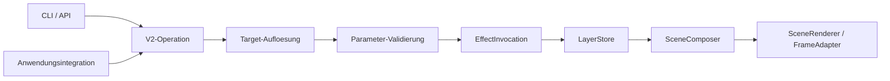

# Aktueller Ansatz im Repo

Stand: 2026-07-29

Der aktive Produktpfad ist ein dauerhaft laufender lokaler Controller-Service,
der per CLI oder HTTP gesteuert wird. Effektdefinitionen sind davon getrennte
LEFX-V2-Artefakte.

## Einstiegspunkte

- `main.py`
- `src/interfaces/cli.py`
- `src/interfaces/api.py`
- `src/services/service.py`
- `src/engine/runtime.py`
- `src/engine/effect_registry.py`
- `src/core/effect_schema.py`

## Verantwortungsgrenzen

- `src/` enthaelt Controller, Runtime, Registry, Loader und Renderer.
- `tools/effect_building/` enthaelt Effektquellen und die separate
  LEFX-/LEFXSET-Buildstrecke.
- `build-tools/` baut EXE und Release-Bundle aus Projektcode und bereits
  gebauten Effektartefakten.
- `src/integrations/` uebersetzt anwendungsspezifische Begriffe wie
  Countdown oder DOA in die generischen Operationen.

Der Controller interpretiert keine fachliche Bedeutung eines Effekts. Er
validiert den Paketvertrag und fuehrt State-, Overlay- und Event-Operationen
aus.

Die 37 autoritativen Standarddefinitionen liegen einzeln unter
`tools/effect_building/sources/states`, `sources/overlays` und
`sources/events`. Der komplette Ordner `tools/effect_building/build` bleibt
wegwerfbarer Buildoutput.

## Datenfluss

## LEFX V2

Ein `.lefx` beschreibt genau eine Definition:

- `state`: unbestimmter Grundzustand auf Background- oder Primary-Slot
- `overlay`: kontrollierte Funktionsanzeige oder zeitbegrenzte Einblendung
- `event`: kurze, endliche und priorisierbare Anzeige

Die Definition enthaelt ihre Renderlogik, Metadaten, Konfigurationsparameter
und gegebenenfalls Runtime-Eingaben. Presets enthalten ausschliesslich
Konfigurationswerte. Eingebettete Commands und beliebige Layerwahl gehoeren
nicht zum V2-Vertrag.

Jede Quelle ist autark. Sie importiert keine andere Definition, keinen
Controller-Code und kein typuebergreifendes `common.py`.

## Oeffentliche Operationen

- `list` und `show` fuer Discovery
- `set` fuer States und Overlays
- `clear` fuer State-Slots und Overlay-Channels
- `update` fuer Runtime-Eingaben kontrollierter Overlays
- `emit` fuer Events

Die API-Basis ist `/api/v2`. Die CLI verwendet dieselben Begriffe. Listen sind
standardmaessig kompakt und liefern lokale IDs; Details werden explizit
angefordert.

## Interne Layer

Die Effekttypen bestimmen die Ziel-Layer:

- States: `BACKGROUND_STATE_LAYER` oder `STATE_LAYER`
- zeitbegrenzte Overlays: `TEMP_OVERLAY_LAYER`
- kontrollierte Overlays: `ONGOING_OVERLAY_LAYER`
- Events: `EVENT_LAYER`

Es gibt keinen oeffentlichen freien Haupt-Layer und keinen `MAIN_LAYER`.

## IDs und Presets

Lokale IDs von Definitionen und Presets sind quelluebergreifend eindeutig.
Dadurch sind kurze Aufrufe wie `set soft_pulse` sicher aufloesbar.
Qualifizierte IDs und Paket-IDs bleiben als explizite Aliase gueltig.

## Wertvalidierung

Konfigurationswerte und Runtime-Eingaben werden getrennt validiert. Das
Schema prueft Typ, Pflichtwert, Minimum, Maximum und Enum-Werte. Farben
akzeptieren kanonische Hexwerte sowie definierte englische und deutsche
Farbnamen und werden intern auf `#RRGGBB` normalisiert.

Animierte Definitionen verwenden `speed` als Multiplikator ihres lokal
definierten Grundverhaltens. Kontrollierte Overlays koennen Eingaben per Push
oder Pull beziehen. Die Engine verwaltet deren Lebenszeichen zeitbasiert und
setzt Eingaben nach drei verpassten Standardfenstern auf `None`; die visuelle
Fehlerreaktion bleibt Eigentum der Definition.

## Persistenz und Betrieb

Nur der Background-State wird in `background_state.json` persistiert. Ohne
gueltigen gespeicherten Zustand startet der Service mit einem schwachen
weissen Grundlicht. `active_service.json` stellt Host-Anwendungen PID, Host
und den effektiv verwendeten Port bereit.

## Bewusst verbleibende Kompatibilitaet

Die V2-Schnittstelle ist der Zielvertrag. V1-Routen fuer Quellenverwaltung,
Status und einzelne anwendungsspezifische Callbacks bleiben vorlaeufig
erhalten, bis eine gesonderte Migrationsentscheidung getroffen wird.
