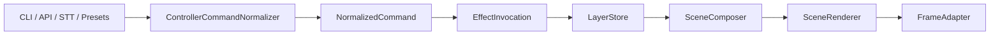

# Aktueller Ansatz Im Repo

Stand: 2026-04-13

Es gibt nur noch einen aktiven Ansatz im Repo:

- ein dauerhaft laufender lokaler Controller-Service
- Steuerung per CLI oder HTTP

Fuer Release 1 ist dieser Service explizit auf den lokalen Unterprozess-Betrieb ausgelegt.

## Einstiegspunkte

Die relevanten Einstiegspunkte sind:

- `main.py`
- `src/interfaces/cli.py`
- `src/interfaces/api.py`
- `src/services/service.py`
- `src/engine/runtime.py`

Optional bleiben zusaetzliche Effektquellen unter `src/led_effects/packages/` oder in einem Release-Bundle unter `packages/` erhalten. Sie erweitern denselben Service, bilden aber keinen eigenen Betriebsweg mehr.

Die Standardeffekte werden als Python-Buildquellen unter `src/led_effects/effects/` gepflegt und ueber `tools/effect_building/build_lefxset.py` in Artefakte gebaut. Die Runtime bootstrapped standardmaessig aus `src/led_effects/effects/default-effects.lefxset`; im Release-Bundle wird bevorzugt `effects/default-effects.lefxset` neben der EXE geladen.

## Datenfluss

Der Service arbeitet intern ueber eine feste Pipeline:



## Zentrale Service-Faehigkeiten

Der Service kann heute direkt:

- Status lesen und health-checken
- Basiszustaende setzen und loeschen
- Events ausloesen
- Countdowns starten, aktualisieren und abbrechen
- Richtungsmarker setzen und loeschen
- Brightness und Enabled schalten
- eingebaute Effekte direkt auf Layer anwenden
- Layer gezielt leeren
- optionale Presets aktivieren
- Portverfuegbarkeit vor dem Start pruefen und optional aus einem Portpool ausweichen
- eine vorhandene aktive Instanz vor dem Neustart uebernehmen und beenden

## Verfuegbare Standardeffekte

Die aktuelle Standardbibliothek wird aus dem Effektset `default-effects.lefxset` geladen.

Wichtige IDs sind:

- `off`
- `solid_color`
- `soft_pulse`
- `blink_color`
- `progress_bar`
- `direction_indicator`
- `countdown_ring`
- `warning_flash`

Die vollstaendige Liste bekommst du ueber:

```powershell
python .\main.py list-effect-sources
python .\main.py list-effects
```

Wie Effektdateien aufgebaut sind und wie du neue Effektmodule erstellst, steht in [effects.md](effects.md).

## Finale Layer

- `BACKGROUND_STATE_LAYER`
- `STATE_LAYER`
- `MAIN_LAYER`
- `TEMP_OVERLAY_LAYER`
- `ONGOING_OVERLAY_LAYER`
- `EVENT_LAYER`

Fuer CLI und API werden kuerzere Layernamen wie `background`, `state`, `main`, `temp_overlay`, `ongoing_overlay` und `event` akzeptiert.

## Abgeschlossene Bereinigungen

- Die Runtime akzeptiert keine `legacy_visual`-Kompatibilitaet mehr.
- Die Default-Registry faellt nicht mehr auf rohe Python-Bibliothekspfade zurueck.
- Zusatzeffekte werden ausschliesslich als `.lefx`- oder `.lefxset`-Artefakte registriert oder autodiscovered.

## Background-State-Persistenz

Der Service speichert den aktiven `BACKGROUND_STATE_LAYER` jetzt in `runtime_state/background_state.json` und stellt ihn beim Start wieder her.

Wenn keine gueltige Persistenzdatei vorhanden ist, setzt der Service als Start-Fallback einen statischen weissen Hintergrund mit `brightness=0.2`, damit das Geraet einen laufenden Service sichtbar anzeigt.

## Release-1-Runtime-Metadaten

Fuer den Unterprozess-Betrieb schreibt der Service zusaetzlich `runtime_state/active_service.json`.

Diese Datei enthaelt die aktive PID sowie Host und Port der laufenden Instanz und ist der vorgesehene Rueckkanal fuer Host-Anwendungen, wenn wegen eines Portpools nicht der urspruenglich angefragte Port verwendet wurde.

## Was entfernt wurde

- der direkte Effects-Engine-Pfad
- lokale Demo- und Showcase-Kommandos ausserhalb des Service-Betriebs
- die dazugehoerige Nutzer- und Entwickler-Doku