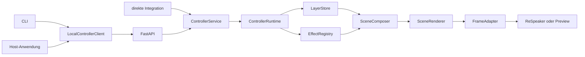
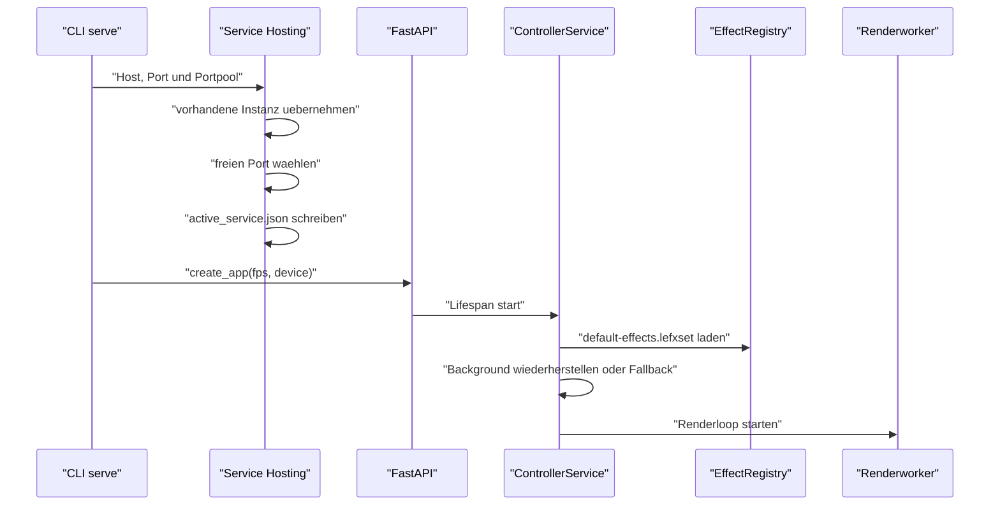
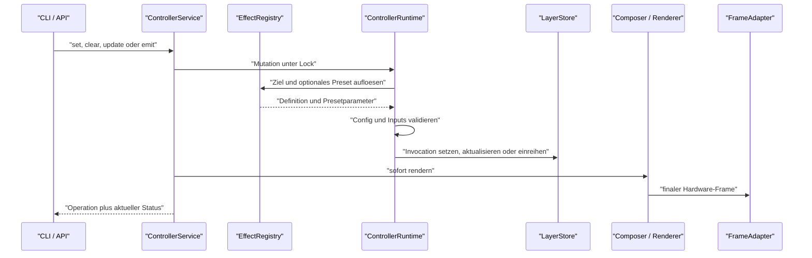

# Aktuelle Architektur

Der aktive Produktpfad ist ein dauerhaft laufender lokaler
Controller-Service. CLI, HTTP API und Anwendungsintegrationen steuern dieselbe
Service- und Runtime-Instanz.

## Systemuebersicht



## Einstiegspunkte

| Einstieg | Aufgabe |
|---|---|
| `main.py` | normaler Projektstart |
| `src/__main__.py` | Start ueber `python -m src` |
| `src/interfaces/cli.py` | Parser, Service-Hosting und HTTP-Client-Kommandos |
| `src/interfaces/api.py` | FastAPI-App und HTTP-Routen |
| `src/interfaces/client.py` | lokaler JSON/HTTP-Client |
| `src/services/service.py` | threadsicherer Service-Wrapper |
| `src/engine/runtime.py` | Mutationen, Layerzustand und Renderablauf |

`main.py` und `src/__main__.py` delegieren an dieselbe CLI-Funktion. Es gibt
keinen separaten zweiten Produktpfad.

## Verzeichnisverantwortung

| Pfad | Aufgabe |
|---|---|
| `src/core/` | Dataclasses, Effektvertrag, Layerstore, Farben und Werte |
| `src/engine/` | Runtime, Registry, Paketloader, Composer und Renderer |
| `src/interfaces/` | CLI, HTTP API und Client |
| `src/services/` | Service-Lifecycle, Renderworker und Hosting |
| `src/integrations/` | anwendungsspezifische Uebersetzung auf V2 |
| `src/infrastructure/` | Pfade, Logging, Persistenz und Hilfsinfrastruktur |
| `src/python_control/` | Low-Level-ReSpeaker-Ansteuerung |
| `tools/effect_building/` | autoritative First-Party-Quellen und LEFX-Build |
| `tools/effect_packager.py` | generische LEFX-/LEFXSET-Werkzeuge |
| `build-tools/` | EXE- und Release-Build aus Code und fertigen Paketen |
| `docs/effect-system/` | verbindliche LEFX-V2-Referenz |

## Zentrale Module

### Core

`src/core/models.py`

- `LED_COUNT`
- `Scene`, `LayerVisual`, `Visual`
- finaler `Frame`
- verbleibende Anwendungskompatibilitaetsmodelle

`src/core/effect_schema.py`

- `DefinitionType`, `OverlayMode`, `LayerId`
- `EffectDefinition`, `EffectParamDefinition`
- `LayerRule`, `EffectCapabilities`, `InputSamplingPolicy`
- `EffectInvocation`, `RenderContext`, `InputContext`
- `BaseEffect`

`src/core/parameter_validation.py`

- Defaults, Preset und Overrides zusammenfuehren
- Config und Inputs getrennt normalisieren
- strukturierte `ValidationIssue`s erzeugen

`src/core/value_normalization.py`

- Farben und Farbaliasse
- Dauer, Winkel, Ratio und Boolean

`src/core/layers.py`

- aktive Invocation je Layer
- Event-Warteschlange
- Ablauf endlicher Instanzen
- Prioritaet plus FIFO

### Engine

`src/engine/effect_package_builder.py`

- Source-Scaffolds
- Quell-, Import- und Vertragsvalidierung
- LEFX- und LEFXSET-Erzeugung
- Hashmanifest und Payload

`src/engine/effect_package_loader.py`

- Paket- und Hashpruefung
- Extraktion in den Runtime-Cache
- expliziter Import von Entry-Modul und Entry-Klasse
- Manifest/Klassen-Abgleich

`src/engine/effect_registry.py`

- Standardset und weitere Quellen laden
- Definitionen und Presets registrieren
- IDs und Aliase aufloesen
- globale Ziel-ID-Kollisionen verhindern
- Autodiscovery und expliziten Reload verwalten

`src/engine/runtime.py`

- V2-Zieloperationen ausfuehren
- Konfiguration und Inputs aufloesen
- Invocations erzeugen
- State-Slots, Overlay-Channels und Event-Queue mutieren
- Ablauf, Persistenzsnapshot und Status verwalten
- Scene rendern und globale Ausgabeeinstellungen anwenden

`src/engine/composer.py`

- aktive Paketklassen instanziieren
- Pull-Sampling takten
- Input-Health anwenden
- pro Layer `render()` aufrufen

`src/engine/renderer.py`

- Layer-Frames in Prioritaetsreihenfolge ueberlagern
- `None` als Transparenz behandeln
- finalen Vollring-Frame erzeugen

### Service und Schnittstellen

`src/services/service.py`

- Runtimezugriff mit Lock schuetzen
- Renderthread starten und stoppen
- nach Mutationen unmittelbar neu rendern
- Hardware-Fallback und Betriebsstatus melden
- Background-State-Persistenz synchronisieren

`src/interfaces/api.py`

- FastAPI-Lifespan startet und stoppt den Service
- V2-Discovery und Steuerung
- V1-Betrieb, Quellenverwaltung und Anwendungskompatibilitaet
- strukturierte HTTP-Fehler

`src/interfaces/client.py`

- JSON-Requests an den lokalen Service
- Best-Effort fuer eingebettete Aufrufer
- striktes Fehlerverhalten fuer die CLI

## Service-Start



Der Service versucht ein echtes ReSpeaker-Geraet zu verwenden. Ist das
Geraet nicht verfuegbar oder wurde `--no-device` gesetzt, verwendet er die
Konsolenvorschau. Der Service kann dabei weiterlaufen und meldet den
degradierten Zustand ueber `/health`.

## Ablauf eines V2-Steuerungskommandos



Erst nach erfolgreicher Ziel- und Wertvalidierung wird der `LayerStore`
veraendert.

## Laufzeit- und Threadmodell

Der Service besitzt einen Renderworker. Dieser:

1. nimmt die konfigurierte FPS als Takt,
2. laesst endliche Invocations ablaufen,
3. komponiert die aktiven Layer,
4. rendert den finalen Frame,
5. schreibt ihn auf den Adapter.

Service-Mutationen laufen unter demselben Lock und rendern unmittelbar nach
der Aenderung. Effektpakete starten keine eigenen Threads. Pull-Sampling und
`render()` laufen kontrolliert im Renderpfad.

## Layer und Runtime-Wahrheit

`LayerStore` plus `EffectInvocation` sind die technische Wahrheit fuer aktive
V2-Darstellungen:

| Layer | Inhalt |
|---|---|
| `BACKGROUND_STATE_LAYER` | optional persistenter Grund-State |
| `STATE_LAYER` | aktueller Primary State |
| `TEMP_OVERLAY_LAYER` | Timed Overlay |
| `ONGOING_OVERLAY_LAYER` | Controlled Overlay |
| `EVENT_LAYER` | aktives Event plus Queue |

Die vollstaendige Semantik steht unter
[Layer und Komposition](../effect-system/03_layers_and_composition.md).

## Registry und Paketladen

Die Default-Registry startet leer und laedt ein gebautes
`default-effects.lefxset`. Weitere Pakete koennen:

- aus `packages/` automatisch gefunden,
- ueber API oder CLI registriert,
- explizit neu geladen,
- aus der laufenden Registry entfernt werden.

Vor der Registrierung werden Hashes, Manifest, Entry-Class,
Definitionsvertrag, Presets und globale IDs geprueft. Eine fehlgeschlagene
Quellenregistrierung wird zurueckgerollt.

First-Party-Quellen liegen unter:

```text
tools/effect_building/sources/states/
tools/effect_building/sources/overlays/
tools/effect_building/sources/events/
```

Der vollstaendige Paketvertrag steht unter
[Pakete, IDs und Konfiguration](../effect-system/08_packages_ids_and_configuration.md).

## Rendering und Ausgabe

Eine Paketinstanz liefert pro `render()` eine Liste mit `LED_COUNT`
Positionen. Farbwerte ersetzen die darunterliegende LED, `None` erhaelt sie.

Nach der Komposition:

- `enabled=false` setzt den ganzen Ring auf Schwarz,
- globale Helligkeit kleiner `1.0` skaliert alle Farben,
- der Adapter schreibt den Vollring-Frame.

Adapter:

- echter ReSpeaker,
- Konsolenvorschau,
- Memory-Adapter fuer Tests.

## Persistenz

Nur der Background State kann persistiert werden. Voraussetzungen:

- aktive Invocation auf `BACKGROUND_STATE_LAYER`,
- `persistent_storage=True` in der Layerregel,
- serialisierbare Parameter,
- kein transienter Servicezustand.

Beim Start:

1. `background_state.json` lesen,
2. gespeicherte Definition und Parameter wiederherstellen,
3. bei Fehler oder fehlender Datei einen gedimmten weissen
   `solid_color`-Fallback setzen.

Primary State, Overlays, Events und Queue werden nicht wiederhergestellt.

## Runtime-Dateien

Unter dem System-Temp-Verzeichnis:

```text
respeaker_led_controller_runtime_state/
|-- active_service.json
|-- background_state.json
`-- effect_package_cache/
```

| Datei / Ordner | Inhalt |
|---|---|
| `active_service.json` | Instance-ID, PID, Host, Port, Status und Logpfad |
| `background_state.json` | persistierbarer Background State |
| `effect_package_cache/` | nach Paket-Hash extrahierte Runtime-Payloads |

Das Basislogging liegt unter `logs/led_controller.log` neben der Anwendung.

## Oeffentliche Oberflaechen

- [CLI-Referenz](../cli_guide.md)
- [HTTP-API-Referenz](../api_guide.md)
- [Public Entry Points](public_entry_points.md)

Direkte freie Layer-Manipulation ist keine oeffentliche V2-Schnittstelle.
Anwendungsspezifische Begriffe werden unter
`src/integrations/application_commands.py` auf generische Operationen
abgebildet.

## Build und Release

Der Effekt-Build und der Produkt-Build sind getrennt:

```text
tools/effect_building/
  Quellen -> LEFX -> LEFXSET

build-tools/
  Projektcode + fertige Pakete -> EXE -> Release-Bundle
```

Details:

- [Effektvalidierung und Paket-Build](../effect-system/10_validation_and_build.md)
- [EXE- und Release-Build](build.md)

## Kompatibilitaet

V2 ist der Zielvertrag. V1 bleibt aktuell fuer:

- Ping und Status,
- Quellenverwaltung,
- einzelne fachliche State-, Event-, Countdown-, Direction- und
  Ausgabekommandos.

Diese Routen verwenden intern dieselbe Runtime. Sie erweitern den
LEFX-V2-Paketvertrag nicht.

Historische Architekturdokumente und fruehere Zielbilder stehen im
[Projektarchiv](../.archive/project-history/README.md).
