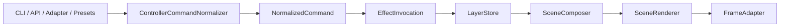

# Runtime Layer-Modell

Diese Seite beschreibt das heutige interne Layer-Modell des Service-Kerns in `src/`.

Sie ist die passende Referenz fuer:

- `src/core/effect_schema.py`
- `src/core/layers.py`
- `src/engine/runtime.py`
- `src/engine/composer.py`
- `src/engine/normalization.py`

## Grundidee

Der laufende Service arbeitet intern nicht mit den alten Begriffen `Background`, `Work`, `Alert`, sondern mit sechs festen Layer-IDs.

Die Pipeline lautet:

## Finale Layer

| Layer | Prioritaet | Zweck | Dauerprofil |
|---|---:|---|---|
| `BACKGROUND_STATE_LAYER` | 100 | persistente Grundanzeige | unbestimmt |
| `STATE_LAYER` | 200 | laufender App-Zustand | unbestimmt |
| `MAIN_LAYER` | 300 | freie Hauptanzeige | endlich oder unbestimmt |
| `TEMP_OVERLAY_LAYER` | 400 | endliche Einblendungen | endlich |
| `ONGOING_OVERLAY_LAYER` | 500 | laufende Overlays | unbestimmt |
| `EVENT_LAYER` | 600 | Event-Queue | endlich |

## Was der Status nach aussen zeigt

`ControllerRuntime.get_status()` exposeiert nicht alle Layernamen direkt, sondern ein kompakteres Snapshot-Modell:

- `base_state`
- `active_visual`
- `event_overlay`
- `render_layers.state_visual`
- `render_layers.direction_visual`
- `render_layers.countdown_visual`

Das bedeutet:

- intern existieren sechs Layer
- nach aussen werden die wichtigsten sichtbaren Gruppen im Snapshot zusammengefasst

## Queue-Verhalten

Nur `EVENT_LAYER` besitzt Queue-Semantik.

Die Regeln sind:

- Sortierung nach `priority`
- bei gleicher Prioritaet FIFO
- das aktuell laufende Event bleibt aktiv
- die Laufzeit beginnt erst bei Aktivierung des Events

Die Aktivierungszeit wird in `src/core/layers.py` ueber `__activated_at` verfolgt.

## Spezialfaelle als normale Effekte

Die Runtime rendert `direction`, `countdown` und `progress` nicht mehr als eigene Sonderpfade. Diese Dinge sind heute normale Effektdefinitionen:

- `direction_indicator`
- `countdown_ring`
- `progress_bar`

Direkte manuelle Effektanwendung laeuft ebenfalls ueber denselben Mechanismus, zum Beispiel per `apply-effect solid_color main`.

## Background-State-Persistenz

`BACKGROUND_STATE_LAYER` ist jetzt end-to-end an eine kleine Persistenzstrecke angeschlossen.

Der aktuelle persistierbare Background-State wird in `runtime_state/background_state.json` geschrieben und beim naechsten Service-Start wiederhergestellt.

Wichtig:

- persistiert wird nur `BACKGROUND_STATE_LAYER`
- nur persistierbare Effektparameter werden in die Datei geschrieben
- transiente Servicemodi wie `offline` und `service_stopping` werden nicht in den gespeicherten Background-State uebernommen
- ohne gueltige Persistenzdatei verwendet der Service als Start-Fallback `solid_color` in Weiss mit `brightness=0.2`
