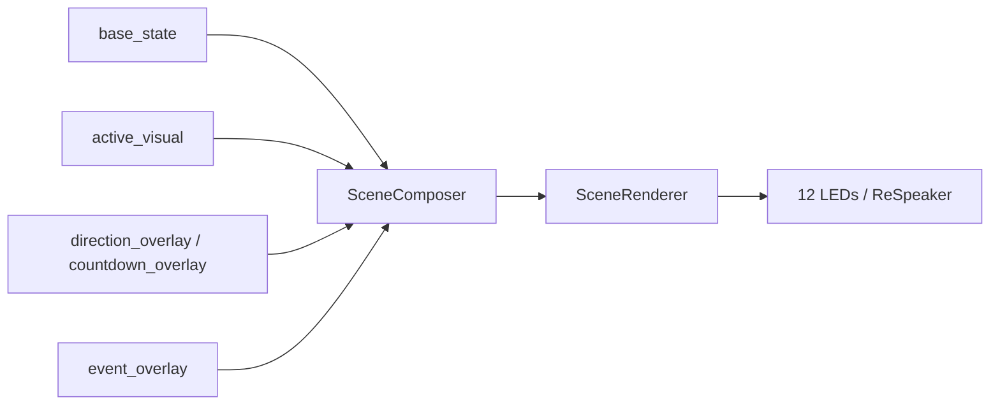

# Runtime Layer-Modell

Diese Seite enthaelt das interne Schichtenmodell der Runtime.

Sie wurde bewusst aus der normalen User-Doku herausgezogen, weil sie fuer den Einstieg nicht noetig ist.

Der Controller arbeitet intern weiter frame-basiert, aber die oeffentliche Semantik ist generischer:

- `base_state`
- `active_visual`
- `direction_overlay`
- `countdown_overlay`
- `event_overlay`

## Grundidee

## `base_state`

Der Controller verwaltet genau einen aktiven Basiszustand.

Typische Inhalte:

- `offline`
- `idle`
- `listening`
- `recording`
- `transcribing`
- `error`

## `active_visual`

Die normale Hauptanzeige, die vom Basiszustand oder optionalen Effekt-Packs gespeist wird.

Typische Inhalte:

- zustandsspezifische Aktivitaetsvisuals
- optionale Preset-/Effekt-Pack-Visuals
- generische Primitive wie `progress`, `pulse` oder `dynamic_frame`

## `direction_overlay` und `countdown_overlay`

Zusaetzliche Hilfsebenen fuer optionale Richtungsdaten und den Timeout-Countdown.

- `direction_overlay` markiert eine Richtung, wenn `direction_deg` gesetzt ist
- `countdown_overlay` laeuft intern im Controller und braucht keine Frame-Steuerung von aussen

## `event_overlay`

Kurzlebige Hinweise mit hoechster Prioritaet.

Typische Inhalte:

- `trigger_received`
- `text_committed`
- `warning`
- `error_flash`
- `timeout_imminent`

## Zusammenspiel

- `base_state` bleibt die semantische Quelle fuer den Dauerzustand
- `active_visual` erzeugt die sichtbare Hauptanimation
- `direction_overlay` und `countdown_overlay` bleiben optional
- `event_overlay` unterbricht temporaer den Basiszustand
- der Composer baut daraus eine `Scene`
- der Renderer erzeugt daraus einen 12-LED-`Frame`
