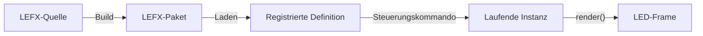
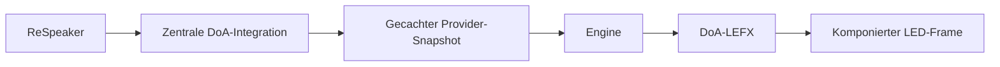

# Ueberblick und Grundidee

## Was ist das Effektsystem?

Das Effektsystem erzeugt das gemeinsame Bild fuer den LED-Ring. Es verbindet
eigenstaendige visuelle Definitionen mit einer generischen Engine:

- **States** bilden den dauerhaften Grundzustand.
- **Overlays** blenden zusaetzliche Informationen ein.
- **Events** zeigen ein kurzes, priorisiertes Signal.

Die Engine setzt diese Beitraege in einer festen Reihenfolge zu einem
LED-Frame zusammen und gibt das Ergebnis an die Hardware aus.

## Warum ist die Logik getrennt?

In frueheren Staenden waren konkrete Darstellungen und ihre Bedeutung Teil des
Controllers. Der Controller musste dadurch wissen, wie einzelne Anzeigen
funktionierten. V2 trennt fachliche Darstellung und generische Ausfuehrung.

| Frueher | LEFX V2 |
|---|---|
| konkrete Darstellungen im Controller | Renderlogik im LEFX-Paket |
| Sonderfaelle anhand konkreter IDs | generische Typvertraege |
| gemeinsam verteilte Effektlogik | autarke Paketquellen |
| Typ konnte indirekt durch Layer oder Preset wechseln | Typ und Lebenszyklus sind fest |

Der Controller kennt weiterhin die allgemeinen Regeln eines States, Overlays
oder Events. Er kennt aber nicht die fachliche Bedeutung einer konkreten
Definition wie `direction_indicator`.

## Das mentale Grundmodell



- Die **Quelle** ist das bearbeitbare Verzeichnis.
- Das **LEFX-Paket** ist die gebaute, unveraenderliche `.lefx`-Datei.
- Die **Definition** beschreibt genau einen State, ein Overlay oder ein Event.
- Die **laufende Instanz** ist eine konkrete Aktivierung dieser Definition.

Ein Preset kann die Konfiguration einer Definition vorbelegen. Es aendert
weder Typ noch Lebenszyklus.

## Drei Typen und ihre Lebenszyklusformen

Es gibt drei fachliche Typen. Overlays besitzen zwei getrennte
Lebenszyklusformen:

```text
Dauerhafter Grundzustand?        -> State
Laufend aktualisierte Anzeige?   -> kontrolliertes Overlay
Zeitlich begrenzte Einblendung?  -> zeitgesteuertes Overlay
Einmaliges priorisiertes Signal? -> Event
```

Push und Pull sind keine weiteren Overlay-Typen. Sie beschreiben lediglich,
wie Runtime-Eingaben eines kontrollierten Overlays bezogen werden.

## Verantwortungen

| Bestandteil | Verantwortung |
|---|---|
| LEFX-Paket | Darstellung, Schemas, Parametersemantik, Renderlogik und optionale Presets |
| Engine | Lebenszyklus, Layer, Komposition, Queue, Input-Health und Hardwareausgabe |
| Integration | Hardwarezugriff, externe Datenquellen und anwendungsspezifische Zuordnung |
| CLI und API | validierte Steuerungskommandos und lesbare Rueckmeldungen |

LEFX-Pakete greifen nicht auf Controller-Services zu. Die Engine waehlt kein
Verhalten anhand einer konkreten Definition-ID.

## Beispiel: DoA

Der ReSpeaker liefert eine erkannte Richtung. Diese Hardwareinformation wird
nicht im DoA-Paket beschafft:



Der Controller aktualisiert den Hardware-Snapshot unabhaengig von einer
konkreten Effektinstanz mit maximal 30 Hz. Die Engine validiert und verteilt
`direction_deg` und `detection_state`. Das LEFX-Paket entscheidet nur, welche
LEDs diese Werte darstellen.

## Beispiel: kurzes Event

```text
emit event short_pulse
-> Konfiguration validieren
-> Instanz in die Event-Queue aufnehmen
-> Frames rendern
-> Instanz nach ihrer Dauer automatisch entfernen
```

Das Paket meldet kein eigenes `finished`. Das Ende gehoert zum Typvertrag und
wird von der Engine verwaltet.

## LEFX und LEFXSET

- `.lefx`: Paket mit genau einer vollstaendigen Definition.
- `.lefxset`: Sammlung mehrerer eigenstaendiger LEFX-Pakete.
- Preset: optionaler Konfigurationsvorschlag fuer eine Definition.

Weiter geht es mit den [verbindlichen Begriffen](02_vocabulary.md).
