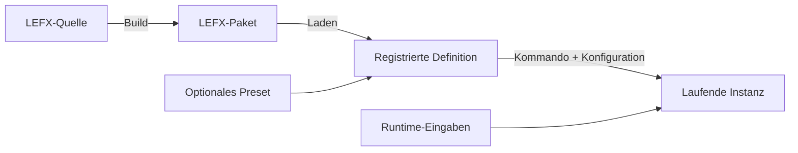

# Begriffe und Systemobjekte

V2 verwendet praezise Begriffe, weil das einzelne Wort `Effekt` Quelle,
Paket, Definition, Preset oder laufende Ausfuehrung meinen koennte.

## Objektkette



## LEFX-Quelle

Eine LEFX-Quelle ist das bearbeitbare Verzeichnis, aus dem ein LEFX-Paket
gebaut wird. Sie enthaelt normalerweise:

- `effect.yaml`
- `effect.py`
- optional `presets.yaml`
- optionale lokale Module und Assets

Die Quelle ist weder das ausgelieferte Paket noch eine laufende Instanz.

## LEFX-Paket

Ein LEFX-Paket ist ein gebautes `.lefx`-Paket mit genau einer State-,
Overlay- oder Event-Definition. Es enthaelt Definition, Renderlogik,
Metadaten, optionale Presets und alle erlaubten lokalen Abhaengigkeiten.

`Artefakt` wird nur verwendet, wenn ausdruecklich das Ergebnis eines Builds
gemeint ist.

## Definition

Eine Effektdefinition, danach kurz **Definition**, beschreibt einen State, ein
Overlay oder ein Event. Sie legt Moeglichkeiten und Grenzen fest, besitzt aber
keinen aktiven Runtime-Zustand.

Zur Definition gehoeren unter anderem:

- Typ und gegebenenfalls Overlay-Modus
- Konfigurations- und Runtime-Input-Schema
- Defaults und Capabilities
- Layer- und Lebenszyklusregeln
- Farbmodell und Kompositionsmodus

Die Renderlogik gehoert zum Paket, das die Definition enthaelt.

## Preset

Ein Preset ist ein optionaler, benannter Konfigurationsvorschlag fuer genau
eine Definition. Es ist ein bequemer Startpunkt, nicht die Hauptbedienform und
keine Begrenzung der frei setzbaren Werte.

Ein Preset darf weder Typ, Overlay-Modus, Layer, Lebensdauer noch
Runtime-Eingaben veraendern.

## Konfiguration

Konfiguration wird beim Aktivieren einer Instanz aufgeloest und validiert. Sie
entsteht in dieser Reihenfolge:

```text
Definition-Defaults -> optionales Preset -> explizite Werte
```

Beispiele sind Farbe, Helligkeit, Geschwindigkeit oder Segmentbreite.

## Runtime-Eingabe

Eine Runtime-Eingabe ist ein mutabler Wert einer laufenden kontrollierten
Overlay-Instanz. Beispiele sind:

- `direction_deg`
- `progress`
- aktuelle Lautstaerke
- extern verwaltete Restzeit

Runtime-Eingaben sind von Konfiguration getrennt und koennen sie nicht
ueberschreiben.

## Steuerungskommando

Ein Steuerungskommando ist eine transportunabhaengige, vollstaendig validierte
Operation. Dasselbe fachliche Kommando kann ueber CLI oder HTTP API eintreffen.

Beispiele:

- State setzen
- Overlay aktualisieren
- Event ausloesen
- laufende Instanz entfernen

Ein ungueltiges Kommando veraendert die Runtime nicht.

## Laufende Instanz

Eine laufende Instanz ist die konkrete Aktivierung einer Definition mit:

- aufgeloester Konfiguration
- Startzeit und Lebenszyklusdaten
- gegebenenfalls Runtime-Eingaben
- einer internen Zuordnung zu Layer oder Event-Queue

Der interne Code verwendet dafuer unter anderem `EffectInvocation`. Dieser
Klassenname ist keine notwendige Benutzersprache.

## Overlay-Channel

Ein Overlay-Channel ist der eindeutige Runtime-Name einer kontrollierten
Overlay-Instanz. Ueber ihn wird die Instanz aktualisiert, mit einem
Lebenszeichen versorgt oder entfernt.

Ein Channel ist keine Definition-ID, kein Preset, keine Package-ID und kein
Layer.

## Layer

Ein Layer ist eine von der Engine verwaltete interne Kompositionsstufe fuer
LED-Frames. Der Typvertrag bestimmt die zulaessige Platzierung; Aufrufer
waehlen keinen beliebigen Layer.

## LEFXSET

Ein LEFXSET ist ein Distributionspaket aus mehreren eigenstaendigen
LEFX-Paketen. Es fuegt kein neues Verhalten hinzu und veraendert seine
Mitglieder nicht.

## IDs

V2 unterscheidet:

- Definition-ID
- Preset-ID
- Source-ID
- Package-ID
- qualifizierte ID
- Overlay-Channel als separaten Runtime-Namensraum

Die vollstaendigen Aufloesungsregeln stehen unter
[Pakete, IDs und Konfiguration](08_packages_ids_and_configuration.md).

## Sprachregel

`Effektsystem` und `Effektentwicklung` bleiben eindeutige Oberbegriffe. In
technischen Aussagen werden Definition, Paket, Preset, State, Overlay, Event
oder laufende Instanz benannt.

```text
Ungenau:  Der Effekt wird aktualisiert.
Praezise: Die Runtime-Eingaben der kontrollierten Overlay-Instanz werden aktualisiert.
```

Historische V1-Begriffe werden nur im Archiv erklaert und steuern keine
aktuelle Implementierung.
