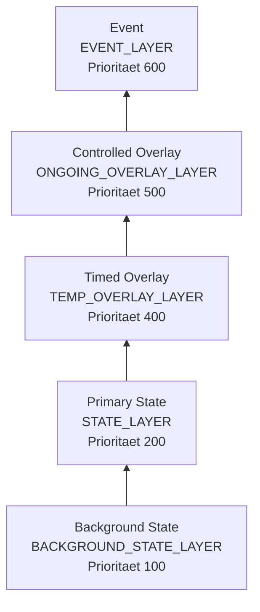
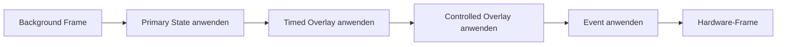

# Layer und Komposition

Das Layer-Modell ist die Grundlage fuer die Trennung von States, Overlays und
Events. Jede aktive Instanz liefert einen LED-Frame. Die Engine kombiniert
diese Frames von unten nach oben.

## LED-Frame

Ein Frame besitzt fuer jede LED genau einen Eintrag:

- ein RGB-Farbwert setzt beziehungsweise ersetzt die LED,
- `None` laesst bei transparenter Komposition den Wert darunter unveraendert.

Ein Paket liefert immer einen vollstaendigen Frame mit der konfigurierten
LED-Anzahl. Die Engine bezieht keine fertigen Frames per Push oder Pull;
`render()` erzeugt sie bei jeder Ausgabe.

Der aktuelle ReSpeaker-Ring besitzt zwoelf LEDs. Definitionen verwenden
trotzdem `ctx.led_count` und geben exakt diese Anzahl Positionen zurueck. Eine
abweichende Laenge ist ein Renderfehler.

## Layer-Stapel



| Lesbarer Name | Technischer Name | Aufgabe |
|---|---|---|
| Background State | `BACKGROUND_STATE_LAYER` | unterster dauerhafter Grundzustand |
| Primary State | `STATE_LAYER` | primaerer Anwendungszustand |
| Timed Overlay | `TEMP_OVERLAY_LAYER` | endliche Einblendung |
| Controlled Overlay | `ONGOING_OVERLAY_LAYER` | laufend kontrollierte Funktionsanzeige |
| Event | `EVENT_LAYER` | priorisiertes einmaliges Signal |

Controlled Overlays liegen bewusst ueber Timed Overlays. Eine laufende
Funktionsanzeige bleibt sichtbar; eine Anzeige, die wirklich alles kurz
ueberlagern soll, ist ein Event.

## Belegung der Layer

| Layer | Aktive Instanzen | Ersetzen | Queue |
|---|---:|---|---|
| Background State | 0 oder 1 | neuer Background State | nein |
| Primary State | 0 oder 1 | neuer Primary State | nein |
| Timed Overlay | 0 oder 1 | neues Timed Overlay | nein |
| Controlled Overlay | 0 oder 1 | neues Controlled Overlay | nein |
| Event | 0 oder 1 aktiv | nicht direkt | wartende Events |

Ein Overlay-Channel ist die Adresse der aktiven kontrollierten Instanz, aber
kein zusaetzlicher Layer. Der heutige Controlled-Overlay-Layer traegt eine
aktive Instanz gleichzeitig.

## Layer- und Eventprioritaet

Die feste Layerprioritaet bestimmt die Reihenfolge der Bildkomposition.
Die optionale Eventprioritaet bestimmt dagegen die Reihenfolge innerhalb der
Event-Warteschlange.

Fuer Events gilt:

1. Das laufende Event bleibt aktiv.
2. Wartende Events mit hoeherer Prioritaet kommen zuerst.
3. Bei gleicher Prioritaet gilt FIFO.
4. Die Dauer beginnt erst, wenn das Event aktiv wird.

```text
aktiv: warning(600)
queue: confirmation(600), notice(600)
neu:   critical(610)

queue danach: critical(610), confirmation(600), notice(600)
```

## Opaque und transparent

Eine Definition deklariert ihren `composition`-Modus.

### Opaque

Ein deckender Frame bestimmt fuer jede LED einen Farbwert. Er verdeckt das
darunterliegende Bild fuer alle Positionen.

### Transparent

Ein transparenter Frame setzt nur die beteiligten LEDs. Alle anderen Eintraege
bleiben `None`.

```text
State:    [blau, blau, blau, blau]
Overlay:  [None, gruen, None, None]
Ergebnis: [blau, gruen, blau, blau]
```

Transparenz ist keine globale Deckkraft. `None` bedeutet ausschliesslich:
Den bereits komponierten Wert an dieser Position erhalten.

`0x000000` ist dagegen ein konkreter schwarzer Farbwert und verdeckt den
Wert darunter.

```text
Background: [blau, blau, blau, blau]
State:      [dunkel, dunkel, dunkel, dunkel]
Timed:      [gelb, None, None, None]
Controlled: [None, gruen, None, None]
Event:      [None, None, rot, None]
Ergebnis:   [gelb, gruen, rot, dunkel]
```

## Kompositionsablauf



Deaktivierte oder nicht belegte Layer tragen nichts bei. Die Engine sortiert
nach interner Prioritaet und uebergibt das fertige Ergebnis an den Renderer
beziehungsweise die Hardwareausgabe.

Technischer Ablauf:

1. `LayerStore` liefert die aktiven Invocations in Prioritaetsreihenfolge.
2. `SceneComposer` instanziiert die Paketklasse pro Invocation.
3. Bei Pull-Overlays wird gegebenenfalls `sample_inputs()` ausgefuehrt.
4. `render()` liefert den Layer-Frame.
5. `SceneRenderer` ersetzt jede nicht-`None` Position.
6. Globale Helligkeit und `enabled` werden auf den fertigen Frame angewendet.
7. Der `FrameAdapter` schreibt den Vollring-Frame auf Hardware oder Preview.
   Der ReSpeaker-Adapter ueberspringt dabei einen USB-Write, wenn der
   vollstaendige LED-Frame unveraendert ist.

Endliche Instanzen werden anhand ihrer Aktivierungszeit und Dauer entfernt.
Das Paket sendet dafuer kein eigenes Abschlusssignal.

## Keine freie Layerauswahl

Aufrufer setzen keine beliebigen internen Layer. Die Definition deklariert
ihren Typ und Lebenszyklusvertrag; daraus ergibt sich die erlaubte
Layergruppe. Ein Preset kann diese Zuordnung nicht veraendern.

Diese Begrenzung verhindert beispielsweise:

- einen dauerhaft laufenden Event-Layer,
- Runtime-Eingaben auf einem State,
- ein endloses Timed Overlay,
- einen State auf der Overlay-Ebene.

Die konkreten Lebenszyklen folgen unter
[Typen und Lebenszyklen](04_effect_types_and_lifecycles.md).
