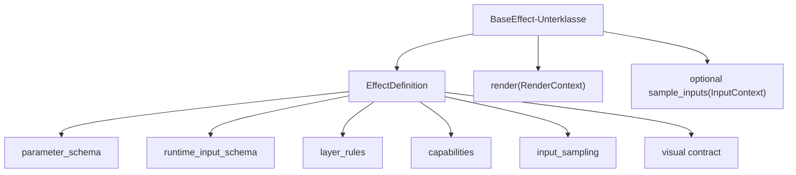

# Schema V2

Das Schema ist der verbindliche Vertrag zwischen LEFX-Paket und Engine. Eine
Quelle wird nur gebaut, wenn Definition, Presets und Paketmetadaten diesen
Vertrag erfuellen.

## Objektmodell



Die Definition ist `frozen` und beschreibt den unveraenderlichen Vertrag.
Aktive Werte liegen in einer separaten `EffectInvocation`. Dadurch koennen
mehrere zeitlich getrennte Aktivierungen dieselbe Definition verwenden, ohne
Metadaten und Laufzeitstatus zu vermischen.

## EffectDefinition

| Feld | Status | Bedeutung |
|---|---|---|
| `id` | Verpflichtend | global eindeutige Definition-ID |
| `title` | Verpflichtend | lesbarer Anzeigename |
| `description` | Verpflichtend | kurze fachliche Beschreibung |
| `definition_type` | Verpflichtend | `state`, `overlay` oder `event` |
| `overlay_mode` | Bedingt | genau bei Overlays: `controlled` oder `timed` |
| `parameter_schema` | Verpflichtend | erlaubte stabile Konfiguration |
| `runtime_input_schema` | Bedingt | mutable Eingaben kontrollierter Overlays |
| `defaults` | Optional | Standardwerte deklarierter Parameter |
| `layer_rules` | Verpflichtend | erlaubte interne Platzierung und Lebensdauer |
| `capabilities` | Verpflichtend | technische Faehigkeiten |
| `color_model` | Verpflichtend | verbindliches Farbmodell |
| `composition` | Verpflichtend | `opaque` oder `transparent` |
| `animated` | Optional | Definition ist zeitlich animiert |
| `directional` | Optional | Definition besitzt eine Bewegungsrichtung |
| `input_sampling` | Bedingt | Bezugs- und Health-Policy fuer Runtime-Eingaben |
| `tags` | Optional | Katalogisierung |
| `version` | Optional | Definitionsversion, Standard `1` |

## Parameterdefinition

Jeder Eintrag in `parameter_schema` und `runtime_input_schema` ist eine
`EffectParamDefinition`.

| Feld | Status | Bedeutung |
|---|---|---|
| `name` | Verpflichtend | muss dem Schema-Schluessel entsprechen |
| `type` | Verpflichtend | kanonischer Wertetyp |
| `required` | Optional | Wert muss vorhanden sein |
| `default` | Optional | Standardwert des Feldes |
| `description` | Empfehlung | fachliche Bedeutung |
| `minimum`, `maximum` | Bedingt | numerische oder listenbezogene Grenzen |
| `enum_values` | Bedingt | erlaubte Werte bei `enum` |
| `unit` | Optional | zum Beispiel `ms`, `deg` oder `multiplier` |
| `nullable` | Optional | `None` ist ein zulaessiger Runtime-Zustand |
| `aliases` | Optional | eindeutige Namen an der Eingabegrenze |

Unterstuetzte Wertetypen sind:

```text
bool, int, float, duration_ms, angle_deg, enum,
color, color_list, gradient, color_range
```

Unbekannte Typen und Felder werden abgewiesen.

### Bedeutung der Schemafelder

- `required=True` verlangt den Wert beim vollstaendigen Aufloesen, sofern kein
  Default existiert.
- `default` am Parameter beschreibt den Feldstandard; `EffectDefinition.defaults`
  enthaelt die effektiv verwendeten Definitionsdefaults.
- `minimum` und `maximum` begrenzen Zahlen sowie bei `color_list` die
  Listenlaenge.
- `enum_values` ist nur fuer `enum` relevant.
- `nullable=True` erlaubt ausdruecklich `None`; ohne dieses Flag ist `None`
  ungueltig.
- `aliases` gelten nur an der Eingabegrenze. Intern existiert nur `name`.

## Capabilities

`EffectCapabilities` beschreibt technische Eigenschaften:

| Feld | Bedeutung |
|---|---|
| `playback_modes` | erlaubte `single_run`, `loop` oder `persistent` Modi |
| `supports_transparency` | transparente Frames sind vorgesehen |
| `supports_duration_override` | Aufrufer darf die Dauer ueberschreiben |
| `supports_queueing` | Instanzen duerfen in eine Queue |
| `preemptible` | Instanz darf unterbrochen werden |
| `restorable` | Instanz kann wiederhergestellt werden |
| `data_driven` | Darstellung verwendet Runtime-Daten |

Capabilities ersetzen keine Typregeln. Ein Event bleibt auch dann endlich,
wenn eine widerspruechliche Capability gesetzt wuerde; der Build lehnt den
Widerspruch ab.

### Playback-Modi

| Modus | Bedeutung |
|---|---|
| `single_run` | einmalige endliche Ausfuehrung |
| `loop` | wiederholte Animation mit unbestimmter Laufzeit |
| `persistent` | unbestimmter, wiederherstellbarer Grundzustand |

Die tatsaechlich erlaubten Modi sind die Schnittmenge aus Capability und
`LayerRule`. Der Typvertrag bleibt uebergeordnet.

## LayerRule

Eine `LayerRule` bindet die Definition an erlaubte interne Layer und
Playback-Modi:

- `allowed`
- `allowed_playback_modes`
- `requires_finite_duration`
- `requires_indefinite_duration`
- `allows_transparency`
- `queue_mode`
- `persistent_storage`

Mindestens ein erlaubter Layer ist erforderlich. Er muss zur Typgruppe passen.

`queue_mode` verwendet:

| Wert | Bedeutung |
|---|---|
| `forbidden` | keine Queue |
| `replace` | bestehende Belegung ersetzen |
| `append` | anhaengen |
| `priority_fifo` | Prioritaet, bei Gleichheit FIFO |

Im aktuellen Runtime-Vertrag besitzt nur der Event-Layer eine Warteschlange.

## InputSamplingPolicy

Nur kontrollierte Overlays duerfen eine Policy besitzen:

| Feld | Standard | Regel |
|---|---:|---|
| `mode` | `push` | `push` oder `pull` |
| `provider_id` | `None` | optionale, nicht leere ID eines vom Controller bereitgestellten Pull-Providers |
| `interval_ms` | `0` | mindestens `0`; bei Pull bedeutet `0` pro Frame |
| `heartbeat_interval_ms` | `1000` | mindestens `100` |
| `max_missed_heartbeats` | `3` | mindestens `1` |

`provider_id` ist nur bei Pull erlaubt. Ohne Provider ruft die Engine die
paketeigene Methode `sample_inputs()` auf. Mit Provider bezieht sie die Werte
ueber die gleichnamige Controller-Integration. Das Effektpaket bleibt dadurch
frei von Hardwaretreibern und kennt nur den vereinbarten Runtime-Input-Vertrag.

## Farbmodell

| Modell | Verpflichtende Konfiguration |
|---|---|
| `none` | keine Farbfelder |
| `mono` | `color` |
| `dual` | `color`, `secondary_color` |
| `palette` | `colors` |
| `gradient` | `gradient` |
| `random_range` | `color_range`, `random_seed` |

Jede farbige Definition deklariert zusaetzlich `brightness` als `float` von
`0.0` bis `1.0`.

## Bedingte Standardfelder

- `animated=True` verlangt `speed`.
- `directional=True` verlangt ein boolesches `reverse`.
- Timed Overlay und Event verlangen `duration_ms` oder `total_ms`.
- Runtime-Eingaben und Input-Sampling sind nur bei Controlled Overlays erlaubt.
- Pull-Sampling verlangt ein nicht leeres Runtime-Input-Schema.
- Eine Provider-ID ist ausschliesslich bei Pull-Sampling erlaubt.

## Runtime-Objekte

### EffectInvocation

Eine Invocation enthaelt unter anderem:

- interne `invocation_id`,
- registrierte `effect_id`,
- Ziel-Layer,
- kanonische `params` und `inputs`,
- Startzeit und optionale Dauer,
- Playback-Modus und Prioritaet,
- Input-Sampling-Zeitpunkte und letzten Samplingfehler.

Interne Metadaten beginnen mit `__` und werden vor `render()` aus den
oeffentlichen Parametern entfernt.

### RenderContext

| Feld | Inhalt |
|---|---|
| `now` | monotone aktuelle Zeit |
| `led_count` | erwartete Frame-Laenge |
| `layer_id` | tatsaechlicher interner Layer |
| `definition` | unveraenderlicher Vertrag |
| `invocation` | aktuelle Laufzeitinstanz |
| `params` | kanonische stabile Konfiguration |
| `inputs` | aktuell wirksame Runtime-Eingaben |

### InputContext

Nur Pull-Overlays erhalten `InputContext` mit `now`, `led_count`, `config`
und `previous_inputs`.

## Definition und Paketmanifest

Die Python-Klasse ist die Quellwahrheit fuer den Effektvertrag. Beim Build
werden Typ, Schemas, Defaults, visuelle Merkmale, Sampling, Layerregeln und
Capabilities in `manifest.json` serialisiert. Beim Laden werden Manifest und
Klassendefinition Feld fuer Feld verglichen.

Dadurch koennen Metadaten im Paket nicht unbemerkt von der ausgefuehrten
Klasse abweichen.

## Typinvarianten

### State

- `definition_type=state`
- kein `overlay_mode`
- nur Background oder Primary State Layer
- unbestimmte Lebensdauer
- keine Runtime-Eingaben

### Controlled Overlay

- `definition_type=overlay`
- `overlay_mode=controlled`
- nur Controlled Overlay Layer
- unbestimmte Lebensdauer
- optionales Runtime-Input-Schema und Push/Pull-Policy

### Timed Overlay

- `definition_type=overlay`
- `overlay_mode=timed`
- nur Timed Overlay Layer
- endliche Dauer
- keine Runtime-Eingaben

### Event

- `definition_type=event`
- kein `overlay_mode`
- nur Event Layer
- endliche Dauer
- keine Runtime-Eingaben

## Kanonischer Ausschnitt

```python
definition = EffectDefinition(
    id="status_marker",
    title="Status Marker",
    description="Zeigt eine extern gelieferte Position.",
    definition_type=DefinitionType.OVERLAY,
    overlay_mode=OverlayMode.CONTROLLED,
    parameter_schema={...},
    runtime_input_schema={...},
    defaults={...},
    capabilities=EffectCapabilities(...),
    layer_rules={...},
    color_model=ColorModel.MONO,
    composition=CompositionMode.TRANSPARENT,
    input_sampling=InputSamplingPolicy(mode=InputMode.PUSH),
)
```

Vollstaendige, pruefbare Quellen stehen unter
[Effektentwicklung](../effect-development/README.md).
