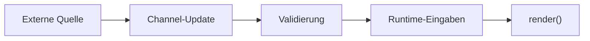
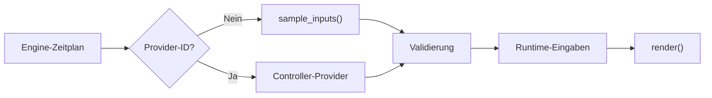

# Runtime-Eingaben

Runtime-Eingaben sind veraenderliche Daten einer laufenden kontrollierten
Overlay-Instanz. Sie sind kein zweiter Konfigurationsweg.

## Konfiguration und Runtime-Daten

| Konfiguration | Runtime-Eingabe |
|---|---|
| beim Aktivieren aufgeloest | waehrend der Laufzeit aktualisiert |
| bleibt fuer die Instanz stabil | darf sich wiederholt aendern |
| Farbe, Breite, Helligkeit | Richtung, Fortschritt, Messwert |
| Defaults, Preset, explizite Werte | Push-Update oder Pull-Sample |

Nur Controlled Overlays duerfen Runtime-Eingaben deklarieren.

`runtime_input_schema` verwendet dieselben Feldtypen und Grenzen wie
`parameter_schema`, wird aber getrennt validiert. Ein Name in `inputs` kann
deshalb keinen gleichnamigen Konfigurationswert ueberschreiben.

## Channel

Jede kontrollierte Overlay-Instanz besitzt einen eindeutigen Channel. Das
erste `set overlay` verbindet Definition, Konfiguration, erste Inputs und
Channel. Spaetere Updates adressieren nur den Channel.

```text
set overlay volume_ring --channel volume --inputs {"progress":35}
update overlay volume --inputs {"progress":60}
clear overlay volume
```

Ein neues `set overlay` auf dem Controlled-Overlay-Layer ersetzt die bisherige
kontrollierte Instanz. Der neue Channel ist danach der aktive Channel dieses
Layers.

## Push

Bei Push sendet eine externe Integration Werte:



Jedes erfolgreiche Update aktualisiert den engine-eigenen Empfangszeitpunkt.
Ein leeres Update ist ein Lebenszeichen: Es aktualisiert den Zeitpunkt und
behaelt die letzten gueltigen Werte.

Typische Push-Beispiele:

- Eine externe Anwendung sendet einen laufend verwalteten Fortschrittswert.
- Lautstaerkesteuerung sendet `progress`.
- Externe Timer-Anwendung sendet `remaining_ms` oder `progress`.

Push-Updates duerfen partiell sein. Nur mitgesendete Felder werden
normalisiert und in die bestehenden Werte uebernommen. Ein unbekanntes oder
ungueltiges Feld verwirft das gesamte Update.

## Pull

Bei Pull bezieht die Engine Werte nach der deklarierten Policy. Ohne
`provider_id` ruft sie die paketlokale Methode `sample_inputs()` auf. Mit
`provider_id` ruft sie einen gleichnamigen Provider auf, den die
Controller-Infrastruktur registriert:



`interval_ms=0` bedeutet eine Abfrage vor jedem Render-Frame. Ein groesserer
Wert entkoppelt Datentakt und Renderframerate. Paketlokales Sampling eignet
sich fuer Quellen, die der Effekt vollstaendig selbst verwalten kann.
Controller-Provider binden zentrale Integrationen wie Hardwareadapter an,
ohne Treiber- oder Anwendungslogik in das Effektpaket zu verschieben.
Ein zentral gepollter Provider darf seinen Snapshot unabhaengig von aktiven
Effekten aktualisieren. Mehrere Effektinstanzen lesen dann denselben
gecachten Wert und loesen keine mehrfachen Hardwarezugriffe aus.

Paketmethode und Provider erhalten denselben `InputContext`:

| Feld | Inhalt |
|---|---|
| `now` | aktuelle monotone Enginezeit |
| `led_count` | Ringgroesse |
| `config` | stabile kanonische Konfiguration |
| `previous_inputs` | zuletzt gueltige Runtime-Werte |

Rueckgabeverhalten:

| Ergebnis | Wirkung |
|---|---|
| gueltiges Objekt | Werte uebernehmen, Erfolgstimestamp aktualisieren |
| partielles Objekt | nur gelieferte Werte uebernehmen |
| `None` | kein Erfolg, letzte Werte zunaechst behalten |
| Exception | Fehler protokollieren, letzte Werte zunaechst behalten |
| ungueltige Werte | Validierungsfehler, keine Teiluebernahme |

## ReSpeaker-DOA

Der mitgelieferte Effekt `direction_indicator` verwendet den Provider
`respeaker_doa`. Der Controller liest `DOA_VALUE` zentral und unabhaengig von
aktiven Effektinstanzen mit maximal 30 Hz aus der ReSpeaker-Firmware. Alle
Verbraucher erhalten denselben gecachten Snapshot.

Das Payload besteht aus zwei `uint16`-Elementen:

| Element | Runtime-Feld | Bedeutung |
|---|---|---|
| `payload[0]` | `direction_deg` | Winkel von `0` bis `359` Grad |
| `payload[1]` | `detection_state` | VAD: `0` wird `none`, `1` wird `sound` |

Ein inaktives VAD ist ein gueltiger und gesunder Messwert, kein
Providerfehler. `direction_indicator` rendert dann vollstaendig transparent.
Bei aktivem VAD legt er genau eine Richtungs-LED ueber den darunterliegenden
State. Der Effekt greift weder auf USB noch auf den Adapter zu.

`interval_ms=0` bedeutet fuer diesen Effekt, dass er vor jedem Renderframe den
bereits gecachten Provider-Snapshot uebernimmt. Es bedeutet nicht, dass jede
Effektinstanz einen eigenen USB-Read ausloest.

## Health und Heartbeat

Standardpolicy:

```text
heartbeat_interval_ms = 1000
max_missed_heartbeats = 3
failure_after_ms = 3000
```

Die Definition darf diese Werte innerhalb der Schema-Grenzen anpassen.

`failure_after_ms` wird als
`heartbeat_interval_ms * max_missed_heartbeats` berechnet und nicht separat
konfiguriert.

| Zustand | Bedeutung |
|---|---|
| `waiting` | noch kein erfolgreicher Wert |
| `healthy` | erfolgreicher Wert innerhalb der Karenzzeit |
| `failed` | maximale Zeit seit letztem Erfolg ueberschritten |

Die Engine bewertet den Empfangszustand, nicht die fachliche Qualitaet des
Messwertes. Ein syntaktisch gueltiger, aber fachlich unplausibler Wert muss
durch Quelle oder Definition entsprechend modelliert werden.

### Zeitlicher Verlauf

Bei einer neuen Instanz ist der Aktivierungszeitpunkt der erste
Heartbeat-Anker. Ein nicht leeres, gueltiges Initial-Input gilt sofort als
erfolgreicher Empfang.

```text
set ohne Wert
-> waiting
-> erstes gueltiges Update
-> healthy
-> mehrere fehlende oder fehlerhafte Intervalle
-> letzte Werte bleiben waehrend der Karenzzeit sichtbar
-> failure_after_ms erreicht
-> failed und effektive Inputs werden None
```

Ein erfolgreiches leeres Push-Update setzt den Empfang ebenfalls auf
`healthy`, ohne die Werte zu veraendern.

## Karenzzeit und None

Waehrend der Karenzzeit bleiben die letzten gueltigen Werte wirksam. Nach
`failure_after_ms` erhaelt `render()` fuer jedes deklarierte Runtime-Feld
`None`.

Die Definition entscheidet ueber die Darstellung:

- vollstaendig transparent werden,
- nur die betroffene Markierung ausblenden,
- einen neutralen Zustand anzeigen.

Die Engine erzwingt keine konkrete visuelle Fehlerdarstellung.

## Countdown richtig modellieren

Ein Countdown kann zwei unterschiedliche Vertraege haben:

- **Timed Overlay:** Start und Dauer stehen fest; die Engine verwaltet das
  Ende, der Renderer leitet den Fortschritt aus der Zeit ab.
- **Controlled Overlay:** Eine externe Anwendung besitzt die Wahrheit ueber
  Restzeit oder Fortschritt und sendet Updates.

Die sichtbare Aehnlichkeit entscheidet nicht ueber den Typ. Entscheidend ist,
wer Lebensdauer und veraenderliche Daten besitzt.

## DoA-Grenze

Die ReSpeaker-Firmware kann DoA unabhaengig vom internen LED-Effekt liefern.
Trotzdem bleibt die Verantwortung getrennt:

```text
ReSpeaker -> USB-Integration -> gecachter Provider-Snapshot
          -> DoA-Definition -> Frame
```

USB-Zugriff, Wiederverbindung und Geraeteauswahl gehoeren in die Integration.
Winkelabbildung und visuelle Reaktion auf `None` gehoeren ins LEFX-Paket.

## Statusausgabe

`status` zeigt fuer aktive datengetriebene Overlays:

```json
{
  "mode": "push",
  "status": "healthy",
  "age_ms": 180,
  "missed_heartbeats": 0,
  "max_missed_heartbeats": 3,
  "last_error": null
}
```

`last_error` enthaelt bei Pull den letzten Sampling- oder
Validierungsfehler. Ein spaeterer Erfolg setzt das Feld wieder auf `null`.

## Grenzen

- Kein Hintergrundthread wird durch ein LEFX-Paket gestartet.
- `render()` fuehrt kein blockierendes I/O aus.
- Hardwarezugriff und gemeinsam genutzte Datenquellen bleiben Integrationen.
- Input-Health beendet die Overlay-Instanz nicht automatisch.
- Die Engine erzeugt keine visuelle Fehleranzeige; das Paket interpretiert
  `None`.
