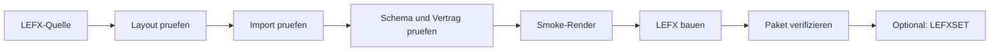

# Validierung und Build

Der Build ist eine Qualitaetsgrenze. Er verpackt nicht nur Dateien, sondern
prueft Quelle, Schema, Import, Typvertrag und einen ersten Renderaufruf.

## Qualitaetskette



## Werkzeuguebersicht

`tools/effect_packager.py` stellt alle generischen Authoring- und
Paketoperationen bereit:

| Kommando | Eingaben | Ergebnis |
|---|---|---|
| `init-effect` | Zielordner, IDs und Typ | neue Einzelquelle |
| `init-effect-set` | Zielordner, Set- und Source-ID | neue Setquelle |
| `init-effect-batch` | Batch-JSON und Ausgabeordner | mehrere Einzelquellen |
| `validate-effect-source` | Einzelquelle | Validierungsbericht |
| `validate-effect-set-source` | Setquelle | Validierungsbericht |
| `pack-effect` | Einzelquelle und Zieldatei | `.lefx` |
| `pack-effect-set` | Setquelle und Zieldatei | `.lefxset` |
| `inspect-effect-package` | `.lefx` oder `.lefxset` | Metadatenuebersicht |
| `verify-effect-package` | `.lefx` oder `.lefxset` | vollstaendige Ladepruefung |

## Quellen erzeugen

State:

```powershell
python .\tools\effect_packager.py init-effect .\my_state `
  --effect-id my_state `
  --source-id my-effects `
  --type state
```

Controlled Overlay:

```powershell
python .\tools\effect_packager.py init-effect .\my_overlay `
  --effect-id my_overlay `
  --source-id my-effects `
  --type overlay `
  --overlay-mode controlled
```

Event:

```powershell
python .\tools\effect_packager.py init-effect .\my_event `
  --effect-id my_event `
  --source-id my-effects `
  --type event
```

Optionen von `init-effect`:

| Option | Pflicht | Bedeutung |
|---|---:|---|
| `--effect-id` | ja | lokale snake_case-ID |
| `--source-id` | ja | Quellenraum |
| `--title` | nein | lesbarer Titel |
| `--package-id` | nein | abweichende Package-ID |
| `--class-name` | nein | abweichender Python-Klassenname |
| `--type` | nein | `state`, `overlay`, `event`; Standard `state` |
| `--overlay-mode` | bedingt | `controlled` oder `timed` |
| `--format` | nein | `yaml` oder `json` |
| `--force` | nein | Scaffold-Dateien auch in einem nicht leeren Zielordner anlegen oder ersetzen |

Setquelle:

```powershell
python .\tools\effect_packager.py init-effect-set .\my_set `
  --set-id my-set `
  --source-id my-effects `
  --title "My Effect Set"
```

`init-effect-set` akzeptiert zusaetzlich `--format yaml|json` und `--force`.

Batch-Datei:

```json
{
  "source_id": "my-effects",
  "effects": [
    {"effect_id": "idle", "type": "state"},
    {
      "effect_id": "volume",
      "type": "overlay",
      "overlay_mode": "controlled"
    },
    {"effect_id": "confirmed", "type": "event"}
  ]
}
```

```powershell
python .\tools\effect_packager.py init-effect-batch `
  .\effects.json `
  .\sources
```

## Quellenvalidierung

`validate-effect-source` prueft unter anderem:

- genau eine lokale `BaseEffect`-Unterklasse,
- existierende Einstiegsklasse,
- erlaubtes Quelllayout,
- bekannte Manifestfelder,
- gueltigen V2-Typvertrag,
- Defaults und Presets gegen das Schema,
- erlaubte Imports,
- keine generische `common.py`.

Die Validierung erzeugt noch kein Distributionspaket.

Erfolgreiche Validierungsantworten enthalten `ok`, Art, Identifier,
`source_id`, Warnungen und Detailwerte wie Package-ID, Entry-Class und
Presetanzahl.

## Import und Autarkie

Der Build importiert die Definition isoliert aus ihrer Quelle. Nicht erlaubt
sind insbesondere:

- Controller-, Service- oder Registry-Imports,
- Importe anderer LEFX-Pakete,
- gemeinsam genutzte Effektlogik,
- eingebettete V1-Commands.

Paketlokale Module und Assets duerfen mitgebaut werden.

Erlaubte absolute Importbereiche:

```text
Python-Standardbibliothek:
__future__, collections, dataclasses, enum, functools, hashlib,
itertools, math, random, statistics, typing

LEFX-SDK:
src.core.color_math
src.core.effect_schema
```

Relative Importe innerhalb der eigenen Quelle sind erlaubt.

## Smoke-Render

Der Standard-Build:

1. instanziiert die Definition,
2. waehlt einen zum Typ passenden Layer und Playback-Modus,
3. erzeugt einen Renderkontext mit Defaults,
4. ruft mindestens einen Frame ab,
5. prueft die erwartete LED-Anzahl.

Ein Smoke-Render findet grundlegende Integrationsfehler. Er ersetzt keine
gezielten Animation-, Grenzwert- oder Hardwaretests.

Der Smoke-Render verwendet aufgeloeste Defaults. Deshalb muessen alle
`required` Felder entweder einen Default besitzen oder bereits in der Quelle
vollstaendig aufloesbar sein.

## Einzelnes LEFX

```powershell
python .\tools\effect_packager.py validate-effect-source <source>
python .\tools\effect_packager.py pack-effect <source> <output.lefx>
python .\tools\effect_packager.py verify-effect-package <output.lefx>
```

`inspect-effect-package` laedt und prueft das Paket ebenfalls, gibt aber eine
Metadatenuebersicht aus. `verify-effect-package` liefert einen kompakten
Nachweis mit Art, Source, Paket beziehungsweise Set, Definitionen und Presets.

## LEFXSET

Ein Set wird bevorzugt aus bereits gebauten und verifizierten LEFX-Paketen
zusammengestellt:

```powershell
python .\tools\effect_packager.py validate-effect-set-source <set-source>
python .\tools\effect_packager.py pack-effect-set <set-source> <output.lefxset>
python .\tools\effect_packager.py verify-effect-package <output.lefxset>
```

Alle Mitglieder muessen zur Source-ID des Sets passen. Definition- und
Preset-IDs duerfen nicht kollidieren.

Setquellen aus bereits gebauten LEFX-Dateien sind reproduzierbarer.
Quellverzeichnisse im `effects/`-Ordner werden zwar gebaut, erzeugen aber eine
Warnung.

## Standard-Build

Autoritative First-Party-Quellen:

```text
tools/effect_building/sources/states/<id>/
tools/effect_building/sources/overlays/<id>/
tools/effect_building/sources/events/<id>/
```

Build:

```powershell
python .\tools\effect_building\build_lefxset.py --rebuild-packages
```

Der normale Release-Build konsumiert nur fertige `.lefx`- und
`.lefxset`-Pakete.

## Build und Cache

`tools/effect_building/build/` enthaelt nur reproduzierbare Ausgaben:

- `.cache/`: temporaere Zwischenstaende
- `output/`: fertiges Standard-LEFXSET
- `published/`: veroeffentlichte Kopie fuer Laufzeit und Release

Nach erfolgreichem Standard-Build wird `.cache/` entfernt. `--keep-cache`
behaelt den Zwischenstand nur fuer gezielte Fehlersuche.

Fertige Ergebnisse unter `output/` und `published/` bleiben bestehen.
Projektweite Test-, Python- und Dokumentationscaches werden ueber
`build-tools/scripts/cleanup_after_build.py` verwaltet.

## Typische harte Fehler

| Fehler | Ursache |
|---|---|
| unbekannter Manifestschluessel | Tippfehler oder nicht unterstuetztes V1-Feld |
| genau eine Klasse nicht gefunden | keine oder mehrere lokale `BaseEffect`-Klassen |
| unsupported import | Quelle greift ausserhalb der erlaubten Paketgrenze zu |
| `common.py` gefunden | generische geteilte Effektlogik |
| Typ-/Layerfehler | Definition passt nicht zu ihren `LayerRule`s |
| fehlende Dauer | Event oder Timed Overlay ohne `duration_ms`/`total_ms` |
| Runtime-Inputs am falschen Typ | Inputs ausserhalb Controlled Overlay |
| ID-Kollision | Definition oder Preset im globalen Namensraum doppelt |
| Hash mismatch | Paketinhalt nach dem Build veraendert |
| Manifest mismatch | serialisierter Vertrag und Python-Klasse weichen ab |

## Checkliste

- Quelle liegt ausserhalb eines loeschbaren Build-Ordners.
- Ordner, Definition-ID und Typ stimmen ueberein.
- `effect.yaml` zeigt auf die existierende Klasse.
- Genau eine lokale Definition ist vorhanden.
- Alle Werte sind im Schema deklariert.
- Endliche Typen besitzen eine Dauer.
- Controlled Overlays trennen Konfiguration und Inputs.
- Presets enthalten nur Konfiguration.
- Paket importiert keinen Controller und kein anderes LEFX.
- Validierung, Build, Verifikation und gezielte Tests sind erfolgreich.

Die praktische Tutorial-Buildfolge steht unter
[LEFX und LEFXSET bauen](../effect-development/tutorials/build_packages.md).
